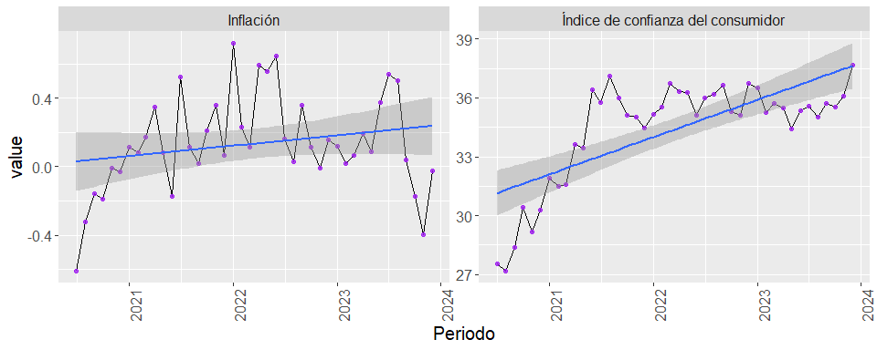

Proyecto de fin de módulo 2
================
Héctor Villegas
2024-04-05

``` r
library(openxlsx)
library(ggplot2)
library(reshape2)
library(dplyr)
library(dygraphs)
library(knitr)
```

## Sección A.-

### 1- Variables seleccionadas.

Para el desarrollo del proyecto se trabajó con las siguientes variables
obtenidas del Banco Central del Ecuador.

#### Sector externo:

- Inversión extranjera directa.
- Comercio exterior importaciones.
- Comercio exterior exportaciones.

#### Sector real:

- Inflación.
- Índice de confianza del consumidor.

### 2- Gráfico de cajas.

Se trabajó con una base de datos de inversión extranjera directa por
país y por continente del periodo 2016 - 2023 con frecuencia trimestral:

``` r

datos_ied <-  read.xlsx("D:\\Programa ECD\\M2\\proyecto\\datos\\sector_externo_ied_x_pais.xlsx", detectDates = T)

datos_ied %>% 
  head(n=5) %>% 
  kable()
```

| País                      |   2016-I |   2016-II |  2016-III |   2016-IV |     2017-I |   2017-II |  2017-III |  2017-IV |     2018-I |    2018-II |   2018-III |    2018-IV |     2019-I |   2019-II |   2019-III |    2019-IV |     2020-I |  2020-II |   2020-III |    2020-IV |    2021-I |   2021-II |   2021-III |  2021-IV |    2022-I |    2022-II |  2022-III |    2022-IV |    2023-I |   2023-II |   2023-III |
|:--------------------------|---------:|----------:|----------:|----------:|-----------:|----------:|----------:|---------:|-----------:|-----------:|-----------:|-----------:|-----------:|----------:|-----------:|-----------:|-----------:|---------:|-----------:|-----------:|----------:|----------:|-----------:|---------:|----------:|-----------:|----------:|-----------:|----------:|----------:|-----------:|
| AMÉRICA                   | 26784.57 | 28465.233 | 75339.088 | 50461.082 | 141547.874 | 51022.545 | 46131.845 | 6559.386 | 194022.176 | 132791.784 | 138855.693 | 415869.166 | 158046.316 | 91562.877 | 102220.348 | 163569.976 | 133792.404 | 29960.36 | 352781.796 |  70161.828 | 89215.622 | 99894.804 | 112203.349 | 64181.41 | 53425.430 | 646043.607 | -9360.084 | -120288.68 |  6862.968 | 31753.061 | 119897.301 |
| Estados Unidos de América | 16583.11 | -1596.654 | 64602.291 |  8008.936 |  11876.448 | 14745.893 |  1972.806 | 6459.788 |  12582.378 |   7700.212 |   2554.901 |  37189.172 |  16424.599 |  4040.233 |  13503.074 |  40409.249 |  61801.939 | 17845.97 |  45769.096 | -38448.918 | 12815.783 | 25901.894 |   4104.787 | 40537.99 | 13204.242 |   1694.704 | 11564.084 |    8780.55 | 21957.193 | 13891.027 |  19116.797 |
| COMUNIDAD ANDINA          | 12659.16 |  6537.054 |  6801.705 |  5409.300 |   6026.008 |  6010.100 |  4016.603 | 5098.683 |  12921.651 |  -4792.913 |  13061.440 |   8337.653 |   7705.604 | -4742.633 |   4158.967 |   8553.545 |   9710.150 |  -156.18 |  -2362.727 |   7548.406 |  7707.864 |  3417.632 |  -2836.230 | 17492.60 |  5840.076 |   4813.045 |  2675.779 |   19190.07 | 13915.036 |  6851.982 |  -5217.950 |
| Bolivia                   |     0.00 |   725.133 |     0.000 |     0.000 |      0.000 |     0.000 |     0.000 |    0.000 |      0.990 |      0.000 |      0.000 |      0.000 |      0.000 |     0.799 |      0.720 |      0.390 |    288.617 |    39.60 |      0.000 |      0.000 |     0.000 |    40.000 |      0.223 |     0.00 |     0.914 |      0.250 |     0.000 |       0.00 |     0.000 |     0.000 |      0.000 |
| Colombia                  | 10446.12 |  5238.162 |  6004.246 |  3686.747 |   6241.465 | -2745.715 |  3374.138 | 6373.930 |   1351.934 |  -3415.659 |  15516.666 |   4365.244 |   6964.288 | -4053.278 |   2737.645 |   7753.787 |  10396.589 |  -232.34 |   3135.322 |   4233.928 |  7015.139 |  3123.155 |  -3092.492 | 15852.97 |  5378.799 |    442.028 |  2800.352 |   18664.95 |  6347.396 |  6237.043 |   4679.488 |

Debido a que no sería práctico presentar los gráficos de caja por cada
país se seleccionaron únicamente los principales socios comerciales del
Ecuador: Estados Unidos, la Comunidad Andina, Europa y China:

``` r
ied_cont <- melt(datos_ied, id.vars = c('País')) %>% 
  filter(País %in% c('Estados Unidos de América', 'COMUNIDAD ANDINA', 'EUROPA', 'China')) %>% 
  rename(Socio=País, periodo=variable) %>% 
  mutate(value=value/1000) %>% 
  mutate(anio=as.numeric(substr(periodo, 1, 4)),
         trimestre=substr(periodo, 6, 8)) %>% 
  select(-periodo) %>% 
  select(Socio, anio, trimestre, everything()) %>% 
  group_by(Socio, anio, trimestre)

ied_cont %>% 
  head(n=10) %>% 
  kable()
```

| Socio                     | anio | trimestre |      value |
|:--------------------------|-----:|:----------|-----------:|
| Estados Unidos de América | 2016 | I         |  16.583113 |
| COMUNIDAD ANDINA          | 2016 | I         |  12.659156 |
| EUROPA                    | 2016 | I         | 120.747878 |
| China                     | 2016 | I         |  27.946418 |
| Estados Unidos de América | 2016 | II        |  -1.596654 |
| COMUNIDAD ANDINA          | 2016 | II        |   6.537054 |
| EUROPA                    | 2016 | II        | 101.068857 |
| China                     | 2016 | II        |  33.162277 |
| Estados Unidos de América | 2016 | III       |  64.602291 |
| COMUNIDAD ANDINA          | 2016 | III       |   6.801705 |

``` r
ggplot(ied_cont)+
  aes(x=factor(anio), y=value, fill=Socio)+
  geom_boxplot()+
  geom_jitter(width=0.1, alpha=0.8)+
  facet_wrap(.~Socio, scales = 'free_x', labeller=labeller(Socio = c("China"="China", "COMUNIDAD ANDINA"="Comunidad Andina", "Estados Unidos de América"="Estados Unidos", "EUROPA"="Europa")))+
  scale_fill_manual(values = c("China" = "#FFD700", "COMUNIDAD ANDINA" = "#FFA07A", "Estados Unidos de América" = "#ADD8E6", "EUROPA" = "#98FB98"),
                    labels=c("China", "Comunidad Andina", "Estados Unidos", "Europa")) +
  theme(legend.position = 'bottom',
        axis.text.x = element_text(angle=90, hjust = 1),
        text=element_text(size = 15))+
  labs(title='Inversión extranjera directa recibida por Ecuador\nde sus socios comerciales',
       subtitle = 'Acumuladas del 1er al 4to trimestre',
       caption = 'Fuente: Banco Central del Ecuador\nElaboración: Héctor Villegas',
       x='Periodo acumulado',
       y='Millones de USD')
```


El gráfico muestra que Europa ha sido el socio comercial que más ha
invertido en el Ecuador entre el 2016 y 2023.

### 3- Gráfico de barras.

Para realizar el gráfico de barras se utilizaron dos bases de datos:

- Importaciones por continente 2016 - 2023 con frecuencia trimestral.

| Período | Continente.Origen | TM.(Peso.Neto) |         FOB |         CIF |
|:--------|:------------------|---------------:|------------:|------------:|
| 2016/T1 | ÁFRICA            |       1946.111 |    3.163030 |    3.446662 |
| 2016/T1 | ÁMERICA           |    2754445.633 | 1955.506212 | 2067.759513 |
| 2016/T1 | ASIA              |     483030.539 | 1201.370122 | 1254.687380 |
| 2016/T1 | EUROPA            |     158730.436 |  492.065258 |  512.917975 |
| 2016/T1 | NO DEFINIDO       |      13511.069 |   38.122588 |   40.517933 |
| 2016/T1 | OCEANÍA           |       1318.982 |    2.988157 |    3.194208 |

- Exportaciones por continente 2016 - 2023 con frecuencia trimestral.

| Período | Continente.Destino | TM.(Peso.Neto) |         FOB |
|:--------|:-------------------|---------------:|------------:|
| 2016/T1 | ÁFRICA             |      21655.263 |   17.498243 |
| 2016/T1 | ÁMERICA            |    5923911.644 | 2085.270743 |
| 2016/T1 | ASIA               |     660507.561 |  574.518607 |
| 2016/T1 | EUROPA             |    1071221.507 |  936.250654 |
| 2016/T1 | NO DEFINIDO        |       1928.651 |    2.622428 |
| 2016/T1 | OCEANÍA            |      17998.051 |   11.025811 |

Para ambas bases de datos se calculó el FOB total por cada año. Los
datos resultantes se combinaron en un dataframe, el cual se usará para
crear el gráfico.

``` r
importaciones <- datos_import %>% 
  mutate(Anio=as.numeric(substr(Período,1,4))) %>% 
  filter(Continente.Origen!='SIN ESTADISTICAS') %>% 
  group_by(Anio) %>% 
  summarise(FOB=sum(FOB)) %>% 
  round(2)


exportaciones <- datos_export %>% 
  mutate(Anio=as.numeric(substr(Período,1,4))) %>% 
  filter(Continente.Destino!='SIN ESTADISTICAS') %>% 
  group_by(Anio) %>% 
  summarise(FOB=sum(FOB)) %>% 
  round(2)

importaciones$Operacion <- "importaciones"
exportaciones$Operacion <- "exportaciones"
datos_comercio <- rbind(importaciones, exportaciones)

datos_comercio %>%
  kable()
```

| Anio |      FOB | Operacion     |
|-----:|---------:|:--------------|
| 2016 | 15559.67 | importaciones |
| 2017 | 19031.42 | importaciones |
| 2018 | 22105.53 | importaciones |
| 2019 | 21472.12 | importaciones |
| 2020 | 16950.31 | importaciones |
| 2021 | 23831.02 | importaciones |
| 2022 | 30316.82 | importaciones |
| 2023 | 29120.10 | importaciones |
| 2016 | 16797.67 | exportaciones |
| 2017 | 19065.96 | exportaciones |
| 2018 | 21652.15 | exportaciones |
| 2019 | 22233.99 | exportaciones |
| 2020 | 20333.89 | exportaciones |
| 2021 | 26699.20 | exportaciones |
| 2022 | 32658.32 | exportaciones |
| 2023 | 31126.42 | exportaciones |

La variable seleccionada para el análisis es FOB (Free on Board) que
indica el precio de un producto incluyendo los costos de transporte
hasta el puerto de embarque.Esta métrica está presente tanto en la base
de datos de importaciones como en la de exportaciones permitiendo la
comparación directa a lo largo del tiempo.

``` r
ggplot(datos_comercio, aes(x = Anio, y = FOB, fill = Operacion)) +
  geom_bar(stat = "identity", position = "dodge")+
  scale_y_continuous(expand = c(0, 0))+
  theme(legend.position = 'bottom',
        axis.text.x = element_text(angle=90, hjust = 1),
        text=element_text(size = 15))+
  labs(title='Exportaciones e importaciones por año',
       subtitle = 'Acumuladas del 1er al 4to trimestre',
       caption = 'Fuente: Banco Central del Ecuador\n Elaboración: Héctor Villegas',
       x='Periodo acumulado',
       y='FOB en Millones de USD',
       fill='Tipo de operación')+
  scale_fill_brewer(palette = 'YlGn')
```


El gráfico de barras presenta una tendencia donde las exportaciones
superan a las importaciones indicando una balanza comercial positiva en
la mayoría de los años. Sin embargo, entre los años 2017 y 2019 la
diferencia entre ambas categorías no es significativa.

### 4- Gráficos de líneas.

Para este gráfico se utilizaron dos bases de datos:

- Inflación mensual desde enero del 2019 hasta diciembre del 2023:

``` r
datos_inflacion <- read.xlsx("D:\\Programa ECD\\M2\\proyecto\\datos\\G2.T2 Inflación Mensual (2005 - Actualidad).xlsx", startRow = 6)

datos_inflacion %>% 
  head() %>% 
  kable()
```

|  AÑO | MES |   NACIONAL |
|-----:|:----|-----------:|
| 2019 | Ene |  0.0046546 |
|   NA | Feb | -0.0022935 |
|   NA | Mar | -0.0021146 |
|   NA | Abr |  0.0017157 |
|   NA | May | -0.0000421 |
|   NA | Jun | -0.0003578 |

- Índice de confianza del consumidor mensual desde julio del 2020 hasta
  diciembre del 2023:

``` r
datos_icc <- read.xlsx("D:\\Programa ECD\\M2\\proyecto\\datos\\Índice de confianza al consumidor - Mensual.xlsx", sheet = 'Indicador', startRow = 6, )[0:42,]

datos_icc %>% 
  head() %>% 
  kable()
```

| Año  | Mes        | Índice.de.Situación.Presente | Índice.de.Expectativas | Índice.de.Confianza.al.Consumidor |
|:-----|:-----------|-----------------------------:|-----------------------:|----------------------------------:|
| 2023 | Diciembre  |                     36.79023 |               39.36161 |                          37.64736 |
| 2023 | Noviembre  |                     35.29969 |               37.62836 |                          36.07591 |
| 2023 | Octubre    |                     34.69140 |               37.18121 |                          35.52134 |
| 2023 | Septiembre |                     34.92750 |               37.29562 |                          35.71688 |
| 2023 | Agosto     |                     34.93602 |               35.24148 |                          35.03784 |
| 2023 | Julio      |                     35.24043 |               36.22031 |                          35.56706 |

Las bases de datos fueron manipuladas para ajustarlas al formato
adecuado, garantizando la coherencia de las variables a lo largo del
periodo establecido. Finalmente, se combinaron en un dataframe para
crear las gráficas.

``` r
datos_inflacion$AÑO <- seq(as.Date("2019/01/01"), as.Date("2023/12/01"), by="month")

datos_inflacion <- datos_inflacion %>% 
  rename(Periodo=AÑO,
         Inflación=NACIONAL) %>% 
  mutate(Inflación=Inflación*100)

meses <- c('Enero', 'Febrero', 'Marzo', 'Abril', 'Mayo', 'Junio',
           'Julio', 'Agosto', 'Septiembre', 'Octubre', 'Noviembre', 'Diciembre')

datos_icc$Mes <-  match(trimws(datos_icc$Mes), meses)

datos_icc <- datos_icc %>% 
  arrange(Año, Mes) %>% 
  mutate(Año=seq(as.Date("2020/07/01"), as.Date("2023/12/01"), by="month")) %>% 
  rename(Periodo=Año)

inf_icc_group <- full_join(datos_inflacion, datos_icc, by='Periodo') %>% 
  select(Periodo, Inflación, Índice.de.Confianza.al.Consumidor) %>% 
  na.omit() %>% 
  melt(id.vars=c('Periodo'))

inf_icc_group %>% 
  head() %>% 
  kable()
```

| Periodo    | variable  |      value |
|:-----------|:----------|-----------:|
| 2020-07-01 | Inflación | -0.6126495 |
| 2020-08-01 | Inflación | -0.3238497 |
| 2020-09-01 | Inflación | -0.1565559 |
| 2020-10-01 | Inflación | -0.1892785 |
| 2020-11-01 | Inflación | -0.0087344 |
| 2020-12-01 | Inflación | -0.0286123 |

``` r
ggplot(data=inf_icc_group)+
  aes(x=Periodo, y=value)+
  geom_line()+
  geom_point(color='purple', alpha=0.8)+
  geom_smooth(method='lm')+
  theme(legend.position = 'bottom',
        axis.text.x = element_text(angle=90, hjust = 1),
        text=element_text(size = 15))+
  facet_wrap(.~variable, scales='free_y', labeller = labeller(variable = c("Inflación" = "Inflación", "Índice.de.Confianza.al.Consumidor" = "Índice de confianza del consumidor")))
```



Las gráficas revelan una tendencia creciente en ambas variables durante
el periodo examinado.

### 5- Gráfico dinámico

Se realizó un gráfico dinámico de inflación para el periodo entre enero
del 2019 y diciembre del 2023. Sin embargo, este tipo de gráfico solo
funciona en archivos HTML por lo que no se renderiza.

``` r
inflacion <- rename(datos_inflacion, Inflacion=Inflación)

datady <- inflacion %>% 
  select(Inflacion)

tsdata <- ts(datady, start = c(2019, 1), frequency = 12)

dygraph(tsdata, main='Evolución de la inflación en Ecuador', xlab = 'Periodo', ylab = 'Tasa porcentual') %>% 
  dyOptions(fillGraph = T, fillAlpha = 0.04, drawPoints = T, pointSize = 3)
```

<div id="htmlwidget-8b9987e084cb92c8ea57" style="width:1344px;height:384px;" class="dygraphs html-widget"></div>
<script type="application/json" data-for="htmlwidget-8b9987e084cb92c8ea57">{"x":{"attrs":{"title":"Evolución de la inflación en Ecuador","xlabel":"Periodo","ylabel":"Tasa porcentual","labels":["month","Inflacion"],"legend":"auto","retainDateWindow":false,"axes":{"x":{"pixelsPerLabel":60,"drawAxis":true},"y":{"drawAxis":true}},"stackedGraph":false,"fillGraph":true,"fillAlpha":0.04,"stepPlot":false,"drawPoints":true,"pointSize":3,"drawGapEdgePoints":false,"connectSeparatedPoints":false,"strokeWidth":1,"strokeBorderColor":"white","colorValue":0.5,"colorSaturation":1,"includeZero":false,"drawAxesAtZero":false,"logscale":false,"axisTickSize":3,"axisLineColor":"black","axisLineWidth":0.3,"axisLabelColor":"black","axisLabelFontSize":14,"axisLabelWidth":60,"drawGrid":true,"gridLineWidth":0.3,"rightGap":5,"digitsAfterDecimal":2,"labelsKMB":false,"labelsKMG2":false,"labelsUTC":false,"maxNumberWidth":6,"animatedZooms":false,"mobileDisableYTouch":true,"disableZoom":false},"scale":"monthly","annotations":[],"shadings":[],"events":[],"format":"date","data":[["2019-01-01T00:00:00.000Z","2019-02-01T00:00:00.000Z","2019-03-01T00:00:00.000Z","2019-04-01T00:00:00.000Z","2019-05-01T00:00:00.000Z","2019-06-01T00:00:00.000Z","2019-07-01T00:00:00.000Z","2019-08-01T00:00:00.000Z","2019-09-01T00:00:00.000Z","2019-10-01T00:00:00.000Z","2019-11-01T00:00:00.000Z","2019-12-01T00:00:00.000Z","2020-01-01T00:00:00.000Z","2020-02-01T00:00:00.000Z","2020-03-01T00:00:00.000Z","2020-04-01T00:00:00.000Z","2020-05-01T00:00:00.000Z","2020-06-01T00:00:00.000Z","2020-07-01T00:00:00.000Z","2020-08-01T00:00:00.000Z","2020-09-01T00:00:00.000Z","2020-10-01T00:00:00.000Z","2020-11-01T00:00:00.000Z","2020-12-01T00:00:00.000Z","2021-01-01T00:00:00.000Z","2021-02-01T00:00:00.000Z","2021-03-01T00:00:00.000Z","2021-04-01T00:00:00.000Z","2021-05-01T00:00:00.000Z","2021-06-01T00:00:00.000Z","2021-07-01T00:00:00.000Z","2021-08-01T00:00:00.000Z","2021-09-01T00:00:00.000Z","2021-10-01T00:00:00.000Z","2021-11-01T00:00:00.000Z","2021-12-01T00:00:00.000Z","2022-01-01T00:00:00.000Z","2022-02-01T00:00:00.000Z","2022-03-01T00:00:00.000Z","2022-04-01T00:00:00.000Z","2022-05-01T00:00:00.000Z","2022-06-01T00:00:00.000Z","2022-07-01T00:00:00.000Z","2022-08-01T00:00:00.000Z","2022-09-01T00:00:00.000Z","2022-10-01T00:00:00.000Z","2022-11-01T00:00:00.000Z","2022-12-01T00:00:00.000Z","2023-01-01T00:00:00.000Z","2023-02-01T00:00:00.000Z","2023-03-01T00:00:00.000Z","2023-04-01T00:00:00.000Z","2023-05-01T00:00:00.000Z","2023-06-01T00:00:00.000Z","2023-07-01T00:00:00.000Z","2023-08-01T00:00:00.000Z","2023-09-01T00:00:00.000Z","2023-10-01T00:00:00.000Z","2023-11-01T00:00:00.000Z","2023-12-01T00:00:00.000Z"],[0.465456261143,-0.229347078498,-0.211455999295,0.171565356043,-0.004207610894,-0.035781895471,0.091334275368,-0.104143223119,-0.011961364761,0.520726461684,-0.703696796229,-0.008186548111,0.227012721181,-0.154420697631,0.197441076879,1.002625234371,-0.259984108389,-0.619814666477,-0.61264945265,-0.323849742065,-0.156555891193,-0.189278490435,-0.008734381945,-0.028612321912,0.116155048064,0.084343695105,0.175396345918,0.349191882645,0.083340753556,-0.175613709191,0.526208567962,0.115489930423,0.015685281085,0.208202988504,0.359534463091,0.067537719459,0.721327782143,0.23249575061,0.112435970591,0.593647834028,0.557410999677,0.6482245167,0.160236369256,0.028598623682,0.356911638598,0.116745907546,-0.007020727067,0.157748202329,0.120586983033,0.018277274577,0.064985238999,0.196217461898,0.089208560651,0.373710729929,0.539043331312,0.502968878962,0.037853311465,-0.175018038644,-0.399199617135,-0.023225585349]],"fixedtz":false,"tzone":""},"evals":[],"jsHooks":[]}</script>
