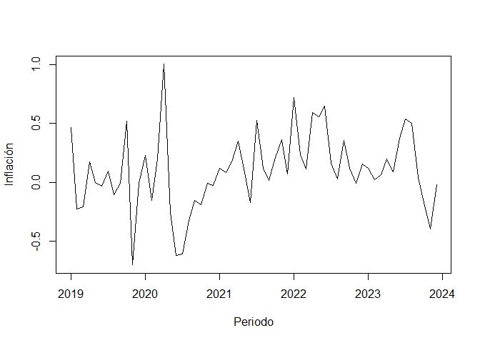
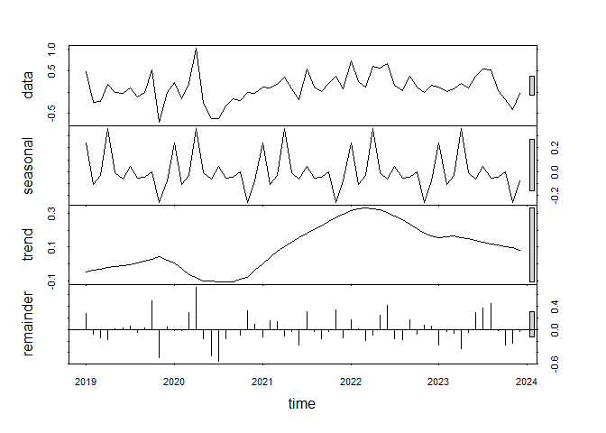
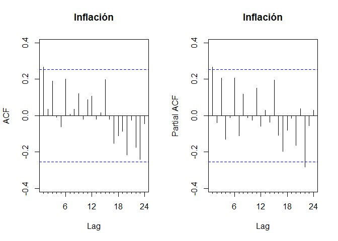
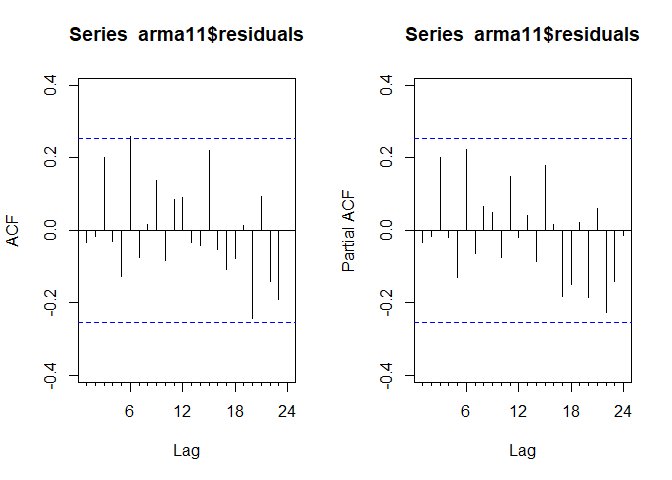
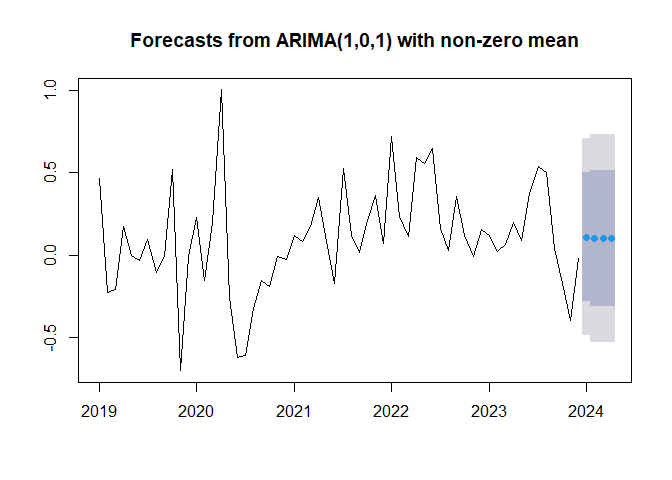
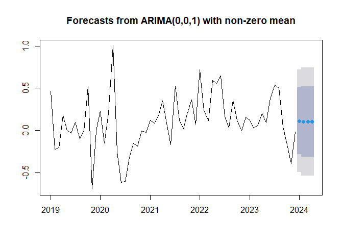
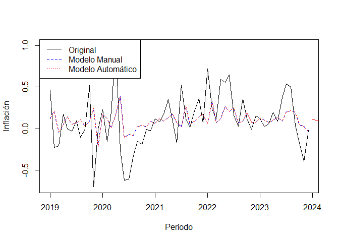

Proyecto de fin de módulo 7
================
Héctor Villegas
2024-08-21

*Librerías*

``` r
library(openxlsx)
library(forecast)
library(knitr)
library(dplyr)
library(urca)
```

## Sección A

### Base de datos

Se utilizó una base de datos de inflación con frecuencia mensual desde
enero del 2019 hasta diciembre del 2023 obtenida del Banco Central del
Ecuador.

``` r
db.inflacion <- read.xlsx("D:\\Programa ECD\\M7\\proyecto\\db\\G2.T2 Inflación Mensual (2005 - Actualidad).xlsx", startRow = 6)

db.inflacion %>% 
  head() %>% 
  kable()
```

|  AÑO | MES |   NACIONAL |
|-----:|:----|-----------:|
| 2019 | Ene |  0.0046546 |
|   NA | Feb | -0.0022935 |
|   NA | Mar | -0.0021146 |
|   NA | Abr |  0.0017157 |
|   NA | May | -0.0000421 |
|   NA | Jun | -0.0003578 |

Se manipuló la base de datos para ajustarlas al formato adecuado,
garantizando la coherencia de las variables a lo largo del periodo
establecido.

``` r
db.inflacion$AÑO <- seq(as.Date("2019/01/01"), as.Date("2023/12/01"), by="month")

db.inflacion <- db.inflacion %>% 
  rename(Periodo=AÑO,
         Inflación=NACIONAL) %>% 
  mutate(Inflación=Inflación*100)

db.inflacion %>% 
  kable()
```

| Periodo    | MES |  Inflación |
|:-----------|:----|-----------:|
| 2019-01-01 | Ene |  0.4654563 |
| 2019-02-01 | Feb | -0.2293471 |
| 2019-03-01 | Mar | -0.2114560 |
| 2019-04-01 | Abr |  0.1715654 |
| 2019-05-01 | May | -0.0042076 |
| 2019-06-01 | Jun | -0.0357819 |
| 2019-07-01 | Jul |  0.0913343 |
| 2019-08-01 | Ago | -0.1041432 |
| 2019-09-01 | Sep | -0.0119614 |
| 2019-10-01 | Oct |  0.5207265 |
| 2019-11-01 | Nov | -0.7036968 |
| 2019-12-01 | Dic | -0.0081865 |
| 2020-01-01 | Ene |  0.2270127 |
| 2020-02-01 | Feb | -0.1544207 |
| 2020-03-01 | Mar |  0.1974411 |
| 2020-04-01 | Abr |  1.0026252 |
| 2020-05-01 | May | -0.2599841 |
| 2020-06-01 | Jun | -0.6198147 |
| 2020-07-01 | Jul | -0.6126495 |
| 2020-08-01 | Ago | -0.3238497 |
| 2020-09-01 | Sep | -0.1565559 |
| 2020-10-01 | Oct | -0.1892785 |
| 2020-11-01 | Nov | -0.0087344 |
| 2020-12-01 | Dic | -0.0286123 |
| 2021-01-01 | Ene |  0.1161550 |
| 2021-02-01 | Feb |  0.0843437 |
| 2021-03-01 | Mar |  0.1753963 |
| 2021-04-01 | Abr |  0.3491919 |
| 2021-05-01 | May |  0.0833408 |
| 2021-06-01 | Jun | -0.1756137 |
| 2021-07-01 | Jul |  0.5262086 |
| 2021-08-01 | Ago |  0.1154899 |
| 2021-09-01 | Sep |  0.0156853 |
| 2021-10-01 | Oct |  0.2082030 |
| 2021-11-01 | Nov |  0.3595345 |
| 2021-12-01 | Dic |  0.0675377 |
| 2022-01-01 | Ene |  0.7213278 |
| 2022-02-01 | Feb |  0.2324958 |
| 2022-03-01 | Mar |  0.1124360 |
| 2022-04-01 | Abr |  0.5936478 |
| 2022-05-01 | May |  0.5574110 |
| 2022-06-01 | Jun |  0.6482245 |
| 2022-07-01 | Jul |  0.1602364 |
| 2022-08-01 | Ago |  0.0285986 |
| 2022-09-01 | Sep |  0.3569116 |
| 2022-10-01 | Oct |  0.1167459 |
| 2022-11-01 | Nov | -0.0070207 |
| 2022-12-01 | Dic |  0.1577482 |
| 2023-01-01 | Ene |  0.1205870 |
| 2023-02-01 | Feb |  0.0182773 |
| 2023-03-01 | Mar |  0.0649852 |
| 2023-04-01 | Abr |  0.1962175 |
| 2023-05-01 | May |  0.0892086 |
| 2023-06-01 | Jun |  0.3737107 |
| 2023-07-01 | Jul |  0.5390433 |
| 2023-08-01 | Ago |  0.5029689 |
| 2023-09-01 | Sep |  0.0378533 |
| 2023-10-01 | Oct | -0.1750180 |
| 2023-11-01 | Nov | -0.3991996 |
| 2023-12-01 | Dic | -0.0232256 |

### Comportamiento de la variable de estudio

``` r
ts.inflacion <- ts(as.vector(as.matrix(db.inflacion$Inflación)),
                   start = c(2019, 1), frequency = 12)

ts.plot(ts.inflacion, xlab='Periodo', ylab='Inflación')
```



La gráfica de inflación muestra un comportamiento volátil, caracterizado
por fluctuaciones significativas en un corto período de tiempo. Se
observa una tendencia general ligeramente al alza, pero con picos y
valles pronunciados.

``` r
plot(stl(ts.inflacion, s.window = 'period'))
```



- Tendencia: La componente de tendencia muestra un crecimiento gradual a
  lo largo del período analizado, con un ligero descenso a mediados de
  2020 y una recuperación posterior.
- Estacionalidad: La componente estacional muestra fluctuaciones
  regulares a lo largo del tiempo, lo que indica la presencia de
  patrones estacionales en los datos. Es decir, la variable tiende a
  aumentar o disminuir en ciertos momentos del año de manera recurrente.
- Residuo: La componente de residuo, o ruido, representa la parte de la
  serie de tiempo que no puede ser explicada por la tendencia ni la
  estacionalidad. En este caso, el residuo muestra una alta volatilidad,
  con valores que oscilan de manera aleatoria alrededor de cero. Esto
  sugiere la presencia de un componente aleatorio o irregular en los
  datos.

### Contrastes

*Dickey-Fuller*

``` r
adftest <- ur.df(ts.inflacion, type=c('trend'),
                 selectlags = c('BIC'))
summary(adftest)
```

    ## 
    ## ############################################### 
    ## # Augmented Dickey-Fuller Test Unit Root Test # 
    ## ############################################### 
    ## 
    ## Test regression trend 
    ## 
    ## 
    ## Call:
    ## lm(formula = z.diff ~ z.lag.1 + 1 + tt + z.diff.lag)
    ## 
    ## Residuals:
    ##      Min       1Q   Median       3Q      Max 
    ## -0.85126 -0.12827 -0.05561  0.20748  0.90923 
    ## 
    ## Coefficients:
    ##              Estimate Std. Error t value Pr(>|t|)    
    ## (Intercept) -0.028163   0.085185  -0.331    0.742    
    ## z.lag.1     -0.827333   0.171388  -4.827 1.18e-05 ***
    ## tt           0.003667   0.002604   1.408    0.165    
    ## z.diff.lag   0.092253   0.136579   0.675    0.502    
    ## ---
    ## Signif. codes:  0 '***' 0.001 '**' 0.01 '*' 0.05 '.' 0.1 ' ' 1
    ## 
    ## Residual standard error: 0.3095 on 54 degrees of freedom
    ## Multiple R-squared:  0.381,  Adjusted R-squared:  0.3466 
    ## F-statistic: 11.08 on 3 and 54 DF,  p-value: 8.957e-06
    ## 
    ## 
    ## Value of test-statistic is: -4.8272 7.8114 11.7166 
    ## 
    ## Critical values for test statistics: 
    ##       1pct  5pct 10pct
    ## tau3 -4.04 -3.45 -3.15
    ## phi2  6.50  4.88  4.16
    ## phi3  8.73  6.49  5.47

Contraste de hipótesis:

- H0: La serie tiene una raíz unitaria (es no estacionaria).
- H1: La serie no tiene una raíz unitaria (es estacionaria).

El valor del estadístico obtenido es -4.8272 el cual es mayor en valor
absoluto que los valores críticos tau3 a todos los niveles de
significancia. Por lo tanto, se tiene evidencia suficiente para rechazar
la hipótesis nula y concluir que la serie no tiene raíz unitaria.

*Phillips-Perron*

``` r
pptest <- ur.pp(ts.inflacion, type=c('Z-tau'),
                model=c('trend'),
                lag=c("short"))

summary(pptest)
```

    ## 
    ## ################################## 
    ## # Phillips-Perron Unit Root Test # 
    ## ################################## 
    ## 
    ## Test regression with intercept and trend 
    ## 
    ## 
    ## Call:
    ## lm(formula = y ~ y.l1 + trend)
    ## 
    ## Residuals:
    ##     Min      1Q  Median      3Q     Max 
    ## -0.8103 -0.1254 -0.0408  0.2045  0.9472 
    ## 
    ## Coefficients:
    ##             Estimate Std. Error t value Pr(>|t|)  
    ## (Intercept) 0.068999   0.042070   1.640   0.1066  
    ## y.l1        0.219013   0.128121   1.709   0.0929 .
    ## trend       0.003919   0.002423   1.618   0.1113  
    ## ---
    ## Signif. codes:  0 '***' 0.001 '**' 0.01 '*' 0.05 '.' 0.1 ' ' 1
    ## 
    ## Residual standard error: 0.3079 on 56 degrees of freedom
    ## Multiple R-squared:  0.1147, Adjusted R-squared:  0.08304 
    ## F-statistic: 3.626 on 2 and 56 DF,  p-value: 0.03304
    ## 
    ## 
    ## Value of test-statistic, type: Z-tau  is: -6.1271 
    ## 
    ##            aux. Z statistics
    ## Z-tau-mu              1.5584
    ## Z-tau-beta            1.6268
    ## 
    ## Critical values for Z statistics: 
    ##                      1pct     5pct     10pct
    ## critical values -4.119005 -3.48618 -3.171061

Contraste de hipótesis:

- H0: La serie tiene una raíz unitaria (es no estacionaria).
- H1: La serie no tiene una raíz unitaria (es estacionaria).

Dado que el valor del estadístico de prueba es mayor en valor absoluto
que los valores críticos, se rechaza la hipótesis nula. Por lo tanto la
serie es estacionaria según el test de Phillips-Perron.

*KPSS*

``` r
kpsstest <- ur.kpss(ts.inflacion, 
                    type=c('tau'),
                    lags = c('short'))

summary(kpsstest)
```

    ## 
    ## ####################### 
    ## # KPSS Unit Root Test # 
    ## ####################### 
    ## 
    ## Test is of type: tau with 3 lags. 
    ## 
    ## Value of test-statistic is: 0.1052 
    ## 
    ## Critical value for a significance level of: 
    ##                 10pct  5pct 2.5pct  1pct
    ## critical values 0.119 0.146  0.176 0.216

Contraste de hipótesis:

- H0: La serie es estacionaria
- H1: La serie no es estacionaria

El valor del estadístico es menor a todos los valores críticos, por lo
tanto no se puede rechazar la hipótesis nula y se concluye que la serie
es estacionaria.

*Elliot, Rothenberg and Stock*

``` r
erstest <- ur.ers(ts.inflacion,
                  type=c('DF-GLS'),
                  model=c('trend'),
                  lag.max = 4)

summary(erstest)
```

    ## 
    ## ############################################### 
    ## # Elliot, Rothenberg and Stock Unit Root Test # 
    ## ############################################### 
    ## 
    ## Test of type DF-GLS 
    ## detrending of series with intercept and trend 
    ## 
    ## 
    ## Call:
    ## lm(formula = dfgls.form, data = data.dfgls)
    ## 
    ## Residuals:
    ##      Min       1Q   Median       3Q      Max 
    ## -0.95766 -0.12471 -0.04214  0.13659  0.77166 
    ## 
    ## Coefficients:
    ##              Estimate Std. Error t value Pr(>|t|)  
    ## yd.lag       -0.51116    0.20192  -2.531   0.0145 *
    ## yd.diff.lag1 -0.12659    0.20085  -0.630   0.5314  
    ## yd.diff.lag2 -0.19890    0.19407  -1.025   0.3104  
    ## yd.diff.lag3  0.07960    0.16817   0.473   0.6380  
    ## yd.diff.lag4 -0.01681    0.14292  -0.118   0.9069  
    ## ---
    ## Signif. codes:  0 '***' 0.001 '**' 0.01 '*' 0.05 '.' 0.1 ' ' 1
    ## 
    ## Residual standard error: 0.3206 on 50 degrees of freedom
    ## Multiple R-squared:  0.3716, Adjusted R-squared:  0.3088 
    ## F-statistic: 5.914 on 5 and 50 DF,  p-value: 0.0002277
    ## 
    ## 
    ## Value of test-statistic is: -2.5315 
    ## 
    ## Critical values of DF-GLS are:
    ##                  1pct  5pct 10pct
    ## critical values -3.58 -3.03 -2.74

Contraste de hipótesis:

- H0: Raíz unitaria
- H1: No raíz unitaria

Dado que el valor del test estadístico es menor en valor absoluto a
todos los valores críticos no se puede rechazar la hipótesis nula y se
concluye que la serie temporal tiene raíz unitaria y no es estacionaria.

Todos los tests coinciden en que la serie es estacionaria por lo que no
es necesario diferenciarla.

## Sección B

### Análisis de la autocorrelación

*Función de Autocorrelación*

``` r
par(mfrow=c(1, 2))
Acf(ts.inflacion, main="Inflación")
Pacf(ts.inflacion, main="Inflación")
```



- Análisis de la estacionalidad:

  En la gráfica de ACF los picos no son tan pronunciados a intervalos
  regulares, lo que sugiere que la estacionalidad no es un factor
  dominante. Mientras que en PACF no se observa un patrón de corte
  significativo en los rezagos que podrían sugerir una estacionalidad
  clara. Por lo tanto, un modelo SARIMA no parece necesario y podría
  utilizarse un modelo ARIMA.

- Selección del modelo ARIMA:

  La ACF muestra un decaimiento lento con algunos rezagos
  significativos, lo cual sugiere la presencia de un componente
  autoregresivo (AR). Además, la PACF se corta abruptamente después de
  los primeros rezagos, lo que es típico de un proceso AR de bajo orden.

El modelo propuesto es un ARMA(1, 1)

### Modelo

``` r
arma11 <- arima(ts.inflacion, order = c(1, 0, 1), fixed = c(0, NA, NA))

arma11
```

    ## 
    ## Call:
    ## arima(x = ts.inflacion, order = c(1, 0, 1), fixed = c(0, NA, NA))
    ## 
    ## Coefficients:
    ##       ar1     ma1  intercept
    ##         0  0.3366     0.1019
    ## s.e.    0  0.1411     0.0525
    ## 
    ## sigma^2 estimated as 0.09345:  log likelihood = -14.09,  aic = 34.17

``` r
accuracy(arma11)
```

    ##                        ME    RMSE       MAE      MPE     MAPE      MASE
    ## Training set -0.001969998 0.30569 0.2257194 82.89808 234.6947 0.8016056
    ##                     ACF1
    ## Training set -0.03389301

``` r
Box.test(arma11$residuals, type=c('Ljung-Box'))
```

    ## 
    ##  Box-Ljung test
    ## 
    ## data:  arma11$residuals
    ## X-squared = 0.072429, df = 1, p-value = 0.7878

Contraste de hipótesis:

H0: Los residuos son independientes  
H1: Los residuos no son independientes  

Dado que p-value es mayor a 0.05 no se puede rechazar la hipótesis nula
y se concluye que los residuos son independientes.

``` r
par(mfrow=c(1, 2))
Acf(arma11$residuals)
Pacf(arma11$residuals)
```



### Pronósticos

Pronóstico con el modelo seleccionado

``` r
pronosticos_manual <- forecast(arma11, h = 4)
plot(pronosticos_manual)
```



Pronóstico con auto.arima

``` r
modelo_auto <- auto.arima(ts.inflacion)
pronosticos_auto <- forecast(modelo_auto, h = 4)
plot(pronosticos_auto)
```



``` r
accuracy(modelo_auto)
```

    ##                        ME    RMSE       MAE     MPE     MAPE     MASE
    ## Training set -0.001970005 0.30569 0.2257194 82.8981 234.6947 0.635365
    ##                     ACF1
    ## Training set -0.03389297

``` r
# Gráfico comparativo
plot(ts.inflacion, type = "l", col = "black", ylim = range(ts.inflacion, pronosticos_manual$mean, pronosticos_auto$mean), ylab = "Inflación", xlab = "Período")
lines(fitted(arma11), col = "blue", lty = 2)
lines(fitted(modelo_auto), col = "red", lty = 3)
lines(pronosticos_manual$mean, col = "blue")
lines(pronosticos_auto$mean, col = "red")
legend("topleft", legend = c("Original", "Modelo Manual", "Modelo Automático"), col = c("black", "blue", "red"), lty = c(1, 2, 3))
```



Ambos modelos, tanto el ARMA(1, 1) manual como el ARIMA (0, 0, 1)
automático, presentan ajustes razonables a la serie de inflación, aunque
con matices diferentes en cuanto a cómo capturan las variaciones de
corto plazo. El ARMA(1, 1) manual parece ser un poco más sensible a las
fluctuaciones, mientras que el ARIMA (0, 0, 1) es más suave.

Si se comparan las métricas de ambos modelos se puede observar que son
parecidas, sin embargo, podría ser útil investigar más para entender
mejor los altos valores del MAPE y MPE, especialmente si los pronósticos
se utilizan en un contexto donde los errores relativos son críticos.
