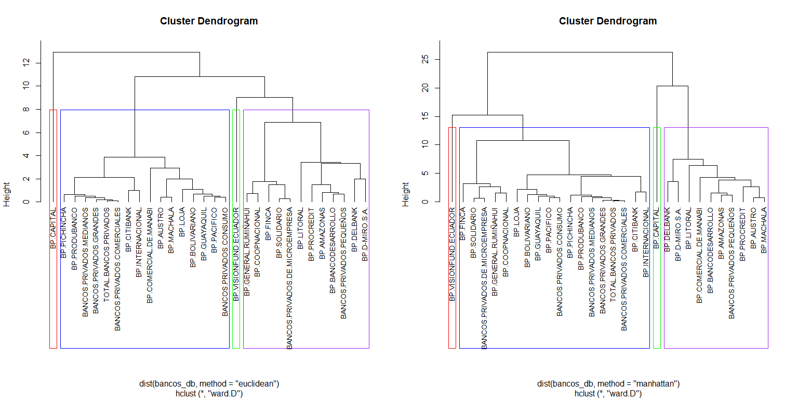
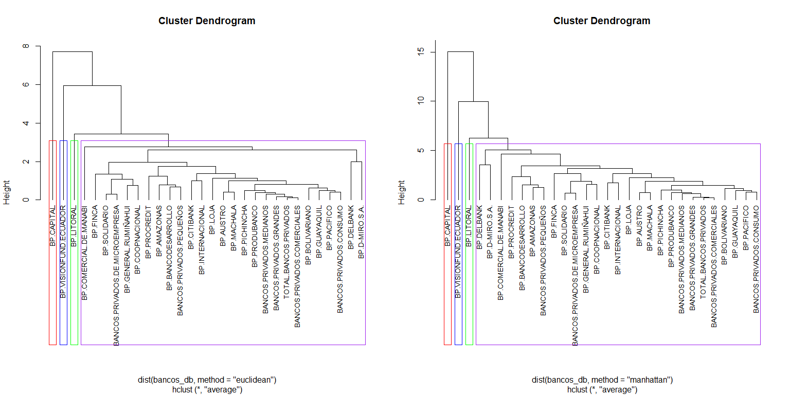
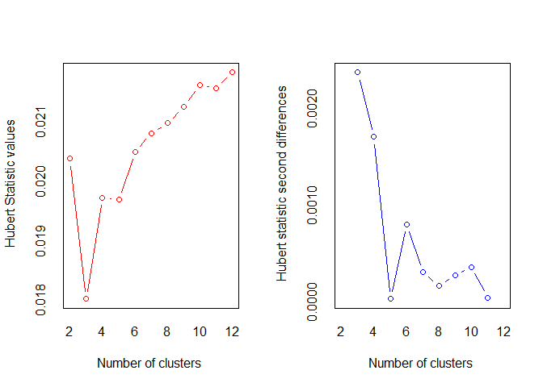
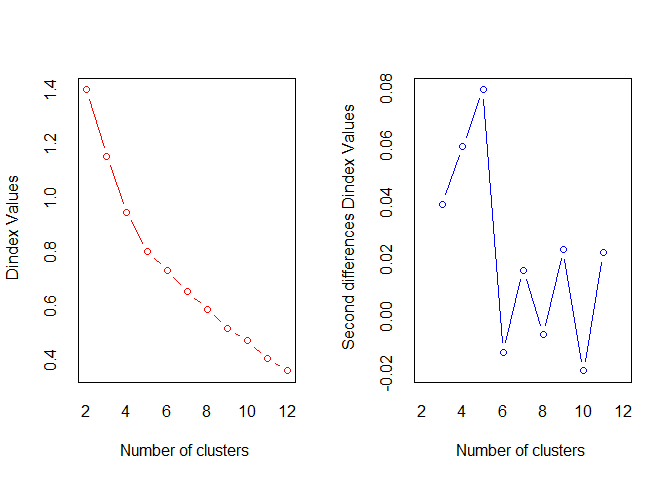
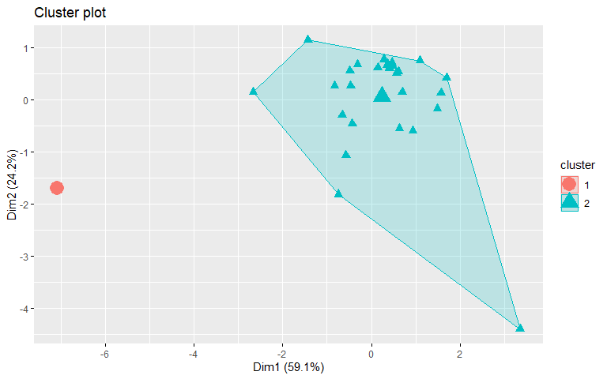
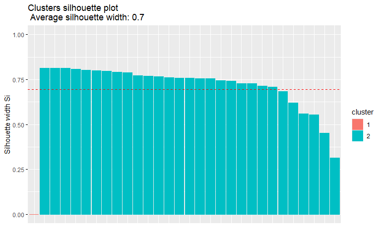

Proyecto de fin de módulo 5
================
Héctor Villegas
2024-06-30

*Librerías*

``` r
library(openxlsx)
library(cluster)
library(factoextra)
library(NbClust)
library(knitr)
library(dplyr)
```

### 1- Base de datos

``` r
data <- read.xlsx("D:\\Programa ECD\\M5\\proyecto\\db\\BOL_BP_MAY_ 2017.xlsx", 
                  sheet = 'INDICADORES', startRow = 8)

data %>% 
  head()%>% 
  kable()
```

| COD..MAF. | NOMBRE.DEL.INDICADOR                                              | BP.GUAYAQUIL | BP.PACIFICO | BP.PICHINCHA | BP.PRODUBANCO | BANCOS.PRIVADOS.GRANDES | BP.AUSTRO | BP.BOLIVARIANO | BP.CITIBANK | BP.GENERAL.RUMIÑAHUI | BP.INTERNACIONAL |    BP.LOJA | BP.MACHALA | BP.SOLIDARIO | BP.PROCREDIT | BANCOS.PRIVADOS.MEDIANOS | BP.AMAZONAS | BP.COMERCIAL.DE.MANABI | BP.LITORAL | BP.COOPNACIONAL | BP.CAPITAL |  BP.FINCA | BP.DELBANK | BP.D-MIRO.S.A. | BP.BANCODESARROLLO | BP.VISIONFUND.ECUADOR | BANCOS.PRIVADOS.PEQUEÑOS | TOTAL.BANCOS.PRIVADOS | BANCOS.PRIVADOS.COMERCIALES | BANCOS.PRIVADOS.CONSUMO | BANCOS.PRIVADOS.VIVIENDA | BANCOS.PRIVADOS.DE.MICROEMPRESA |
|:----------|:------------------------------------------------------------------|-------------:|------------:|-------------:|--------------:|------------------------:|----------:|---------------:|------------:|---------------------:|-----------------:|-----------:|-----------:|-------------:|-------------:|-------------------------:|------------:|-----------------------:|-----------:|----------------:|-----------:|----------:|-----------:|---------------:|-------------------:|----------------------:|-------------------------:|----------------------:|----------------------------:|------------------------:|-------------------------:|--------------------------------:|
| NA        | SUFICIENCIA PATRIMONIAL                                           |           NA |          NA |           NA |            NA |                      NA |        NA |             NA |          NA |                   NA |               NA |         NA |         NA |           NA |           NA |                       NA |          NA |                     NA |         NA |              NA |         NA |        NA |         NA |             NA |                 NA |                    NA |                       NA |                    NA |                          NA |                      NA |                       NA |                              NA |
| IF114     | ( PATRIMONIO + RESULTADOS ) / ACTIVOS INMOVILIZADOS NETOS (3) (6) |    2.0709348 |   2.4064509 |    5.9227587 |     2.7112073 |               3.1673368 | 1.6469929 |      4.5464231 |  -3.2429260 |          -14.5009863 |       10.0342258 | 14.5908875 |  1.6898021 |   25.4809526 |    2.1849621 |                4.8604965 |   1.7958932 |              1.2640301 |   1.929328 |      17.8668927 |  0.7978005 | 3.6021652 |  4.1136228 |      2.4870205 |          2.6040503 |            11.9758795 |                 2.385257 |             3.4931005 |                   4.0092864 |               2.2814627 |                       NA |                       8.6411909 |
| NA        | ESTRUCTURA Y CALIDAD DE ACTIVOS:                                  |           NA |          NA |           NA |            NA |                      NA |        NA |             NA |          NA |                   NA |               NA |         NA |         NA |           NA |           NA |                       NA |          NA |                     NA |         NA |              NA |         NA |        NA |         NA |             NA |                 NA |                    NA |                       NA |                    NA |                          NA |                      NA |                       NA |                              NA |
| IF102     | ACTIVOS IMPRODUCTIVOS NETOS / TOTAL ACTIVOS                       |    0.1845828 |   0.2134036 |    0.1480012 |     0.1615428 |               0.1707446 | 0.1901464 |      0.2018487 |   0.1355867 |            0.0731654 |        0.1279155 |  0.1852959 |  0.2016102 |    0.0603812 |    0.1589583 |                0.1569258 |   0.1451531 |              0.2873656 |   0.173515 |       0.0477796 |  0.2733478 | 0.0844926 |  0.1963298 |      0.0857846 |          0.1042135 |             0.0301021 |                 0.125213 |             0.1651592 |                   0.1611691 |               0.1942835 |                       NA |                       0.0666944 |
| IF101     | ACTIVOS PRODUCTIVOS / TOTAL ACTIVOS                               |    0.8154172 |   0.7865964 |    0.8519988 |     0.8384572 |               0.8292554 | 0.8098536 |      0.7981513 |   0.8644133 |            0.9268346 |        0.8720845 |  0.8147041 |  0.7983898 |    0.9396188 |    0.8410417 |                0.8430742 |   0.8548469 |              0.7126344 |   0.826485 |       0.9522204 |  0.7266522 | 0.9155074 |  0.8036702 |      0.9142154 |          0.8957865 |             0.9698979 |                 0.874787 |             0.8348408 |                   0.8388309 |               0.8057165 |                       NA |                       0.9333056 |
| IF688     | ACTIVOS PRODUCTIVOS / PASIVOS CON COSTO                           |    1.2344212 |   1.3704368 |    1.3969758 |     1.4835507 |               1.3757494 | 1.0360957 |      1.3167972 |   7.9896021 |            1.1259405 |        1.0714405 |  1.1197187 |  1.2631276 |    1.1954979 |    1.0579189 |                1.1947481 |   1.1554407 |              1.0701246 |   1.328974 |       1.1530411 |  0.9972401 | 1.2374906 |  1.8575000 |      1.1194510 |          1.0262336 |             1.4461051 |                 1.141756 |             1.3048420 |                   1.3325000 |               1.2414271 |                       NA |                       1.1664086 |

Se modificó la base de datos para darle un formato apropiado para el
análisis clúster y seleccionar las variables de interés.

``` r
bancos_db <- data %>% 
  filter(NOMBRE.DEL.INDICADOR %in% 
           c('ACTIVOS PRODUCTIVOS / TOTAL ACTIVOS', 
             'MOROSIDAD DE LA CARTERA TOTAL', 
             'GASTOS DE OPERACION  / MARGEN FINANCIERO', 
             'RESULTADOS DEL EJERCICIO / ACTIVO PROMEDIO', 
             'FONDOS DISPONIBLES / TOTAL DEPOSITOS A CORTO PLAZO')) %>% 
  select(-COD..MAF.) %>% 
  t %>% 
  as.data.frame()

colnames(bancos_db) <- bancos_db[1,]

bancos_db <- bancos_db[-1, ]


bancos_db %>% 
  kable()
```

|                                 | ACTIVOS PRODUCTIVOS / TOTAL ACTIVOS | MOROSIDAD DE LA CARTERA TOTAL | GASTOS DE OPERACION / MARGEN FINANCIERO | RESULTADOS DEL EJERCICIO / ACTIVO PROMEDIO | FONDOS DISPONIBLES / TOTAL DEPOSITOS A CORTO PLAZO |
|:--------------------------------|:------------------------------------|:------------------------------|:----------------------------------------|:-------------------------------------------|:---------------------------------------------------|
| BP.GUAYAQUIL                    | 0.81541724                          | 0.03064943                    | 0.78362021                              | 0.01070861                                 | 0.34377067                                         |
| BP.PACIFICO                     | 0.78659640                          | 0.03755224                    | 0.82929987                              | 0.01033806                                 | 0.31105061                                         |
| BP.PICHINCHA                    | 0.851998807                         | 0.041028468                   | 0.922436137                             | 0.009629834                                | 0.201239348                                        |
| BP.PRODUBANCO                   | 0.838457200                         | 0.024946927                   | 0.895376828                             | 0.006401269                                | 0.239003176                                        |
| BANCOS.PRIVADOS.GRANDES         | 0.82925539                          | 0.03601576                    | 0.87325284                              | 0.00941218                                 | 0.25294884                                         |
| BP.AUSTRO                       | 0.809853560                         | 0.061813095                   | 0.969650675                             | 0.002343685                                | 0.274503555                                        |
| BP.BOLIVARIANO                  | 0.798151287                         | 0.013080900                   | 0.801078126                             | 0.007326165                                | 0.364377806                                        |
| BP.CITIBANK                     | 0.8644133355                        | 0.0009472339                  | 0.6941305736                            | 0.0180021991                               | 0.3425838482                                       |
| BP.GENERAL.RUMIÑAHUI            | 0.92683461                          | 0.02402669                    | 0.77009914                              | 0.01332103                                 | 0.34704696                                         |
| BP.INTERNACIONAL                | 0.87208447                          | 0.01660947                    | 0.66859290                              | 0.01091718                                 | 0.23103273                                         |
| BP.LOJA                         | 0.81470406                          | 0.05843954                    | 0.71565140                              | 0.01376022                                 | 0.40474658                                         |
| BP.MACHALA                      | 0.798389760                         | 0.042589419                   | 0.946838701                             | 0.002597089                                | 0.302391257                                        |
| BP.SOLIDARIO                    | 0.93961882                          | 0.06470354                    | 0.85785359                              | 0.01034940                                 | 0.35404403                                         |
| BP.PROCREDIT                    | 0.8410417108                        | 0.0425556359                  | 1.4195301663                            | 0.0001252713                               | 0.2586206224                                       |
| BANCOS.PRIVADOS.MEDIANOS        | 0.843074182                         | 0.030156998                   | 0.807668230                             | 0.008390013                                | 0.302274033                                        |
| BP.AMAZONAS                     | 0.854846891                         | 0.074538865                   | 1.051161963                             | 0.002424085                                | 0.236225361                                        |
| BP.COMERCIAL.DE.MANABI          | 0.7126343766                        | 0.0940461413                  | 0.9536344657                            | 0.0008679793                               | 0.2362357857                                       |
| BP.LITORAL                      | 0.8264850                           | 0.1246920                     | 1.3693360                               | -0.0174591                                 | 0.2124923                                          |
| BP.COOPNACIONAL                 | 0.952220391                         | 0.003567011                   | 0.729240392                             | 0.009959174                                | 0.269343173                                        |
| BP.CAPITAL                      | 0.72665221                          | 0.29902254                    | 3.07877252                              | -0.02343208                                | 0.27318239                                         |
| BP.FINCA                        | 0.915507384                         | 0.044188059                   | 1.242337041                             | 0.008558966                                | 0.192041775                                        |
| BP.DELBANK                      | 0.803670169                         | 0.127915218                   | 1.007846590                             | 0.006142088                                | 0.589730665                                        |
| BP.D-MIRO.S.A.                  | 0.914215393                         | 0.158303052                   | 1.225549931                             | 0.003024918                                | 0.507054335                                        |
| BP.BANCODESARROLLO              | 0.8957865088                        | 0.0775399263                  | 1.1894810881                            | 0.0006318423                               | 0.3324563528                                       |
| BP.VISIONFUND.ECUADOR           | 0.96989791                          | 0.04334920                    | 0.82014334                              | 0.02666783                                 | 1.34897743                                         |
| BANCOS.PRIVADOS.PEQUEÑOS        | 0.874786975                         | 0.105199369                   | 1.103544185                             | 0.001968583                                | 0.285764741                                        |
| TOTAL.BANCOS.PRIVADOS           | 0.834840789                         | 0.035948609                   | 0.860108844                             | 0.008898606                                | 0.269801725                                        |
| BANCOS.PRIVADOS.COMERCIALES     | 0.838830922                         | 0.031329202                   | 0.853605291                             | 0.009108897                                | 0.259615962                                        |
| BANCOS.PRIVADOS.CONSUMO         | 0.805716464                         | 0.044933681                   | 0.867445487                             | 0.008219284                                | 0.303742277                                        |
| BANCOS.PRIVADOS.VIVIENDA        | NA                                  | 0                             | NA                                      | NA                                         | NA                                                 |
| BANCOS.PRIVADOS.DE.MICROEMPRESA | 0.933305641                         | 0.072401560                   | 0.923132389                             | 0.008814753                                | 0.327990657                                        |

Se filtraron los registros con variables nulas:

``` r
bancos_db <- bancos_db %>% 
  filter(complete.cases(.))

str(bancos_db)
```

    ## 'data.frame':    30 obs. of  5 variables:
    ##  $ ACTIVOS PRODUCTIVOS / TOTAL ACTIVOS               : chr  "0.81541724" "0.78659640" "0.851998807" "0.838457200" ...
    ##  $ MOROSIDAD DE LA CARTERA TOTAL                     : chr  "0.03064943" "0.03755224" "0.041028468" "0.024946927" ...
    ##  $ GASTOS DE OPERACION  / MARGEN FINANCIERO          : chr  "0.78362021" "0.82929987" "0.922436137" "0.895376828" ...
    ##  $ RESULTADOS DEL EJERCICIO / ACTIVO PROMEDIO        : chr  "0.01070861" "0.01033806" "0.009629834" "0.006401269" ...
    ##  $ FONDOS DISPONIBLES / TOTAL DEPOSITOS A CORTO PLAZO: chr  "0.34377067" "0.31105061" "0.201239348" "0.239003176" ...

Las variables se convirtieron a tipo numérico y posteriormente se
realizó el escalamiento:

``` r
bancos_db <- bancos_db %>% 
  mutate(across(everything(), as.numeric)) %>% 
  scale()

bancos_db %>% 
  kable()
```

|                                 | ACTIVOS PRODUCTIVOS / TOTAL ACTIVOS | MOROSIDAD DE LA CARTERA TOTAL | GASTOS DE OPERACION / MARGEN FINANCIERO | RESULTADOS DEL EJERCICIO / ACTIVO PROMEDIO | FONDOS DISPONIBLES / TOTAL DEPOSITOS A CORTO PLAZO |
|:--------------------------------|------------------------------------:|------------------------------:|----------------------------------------:|-------------------------------------------:|---------------------------------------------------:|
| BP.GUAYAQUIL                    |                          -0.5538076 |                    -0.5388546 |                              -0.5140425 |                                  0.4860223 |                                          0.0221853 |
| BP.PACIFICO                     |                          -1.0201591 |                    -0.4204719 |                              -0.4092436 |                                  0.4454725 |                                         -0.1346752 |
| BP.PICHINCHA                    |                           0.0381206 |                    -0.3608548 |                              -0.1955691 |                                  0.3679703 |                                         -0.6611122 |
| BP.PRODUBANCO                   |                          -0.1809968 |                    -0.6366521 |                              -0.2576489 |                                  0.0146639 |                                         -0.4800718 |
| BANCOS.PRIVADOS.GRANDES         |                          -0.3298918 |                    -0.4468224 |                              -0.3084061 |                                  0.3441521 |                                         -0.4132161 |
| BP.AUSTRO                       |                          -0.6438338 |                    -0.0044001 |                              -0.0872489 |                                 -0.4293631 |                                         -0.3098824 |
| BP.BOLIVARIANO                  |                          -0.8331889 |                    -0.8401535 |                              -0.4739903 |                                  0.1158766 |                                          0.1209762 |
| BP.CITIBANK                     |                           0.2390007 |                    -1.0482450 |                              -0.7193509 |                                  1.2841699 |                                          0.0164956 |
| BP.GENERAL.RUMIÑAHUI            |                           1.2490425 |                    -0.6524341 |                              -0.5450628 |                                  0.7719030 |                                          0.0378919 |
| BP.INTERNACIONAL                |                           0.3631277 |                    -0.7796388 |                              -0.7779398 |                                  0.5088464 |                                         -0.5182822 |
| BP.LOJA                         |                          -0.5653476 |                    -0.0622563 |                              -0.6699775 |                                  0.8199642 |                                          0.3145048 |
| BP.MACHALA                      |                          -0.8293301 |                    -0.3340847 |                              -0.1395844 |                                 -0.4016328 |                                         -0.1761883 |
| BP.SOLIDARIO                    |                           1.4559045 |                     0.0451709 |                              -0.3437353 |                                  0.4467134 |                                          0.0714359 |
| BP.PROCREDIT                    |                          -0.1391767 |                    -0.3346640 |                               0.9448709 |                                 -0.6721272 |                                         -0.3860254 |
| BANCOS.PRIVADOS.MEDIANOS        |                          -0.1062892 |                    -0.5472997 |                              -0.4588712 |                                  0.2322950 |                                         -0.1767503 |
| BP.AMAZONAS                     |                           0.0842056 |                     0.2138459 |                               0.0997555 |                                 -0.4205648 |                                         -0.4933887 |
| BP.COMERCIAL.DE.MANABI          |                          -2.2169424 |                     0.5483943 |                              -0.1239935 |                                 -0.5908516 |                                         -0.4933387 |
| BP.LITORAL                      |                          -0.3747196 |                     1.0739684 |                               0.8297148 |                                 -2.5964094 |                                         -0.6071654 |
| BP.COOPNACIONAL                 |                           1.6598112 |                    -1.0033160 |                              -0.6388015 |                                  0.4040104 |                                         -0.3346214 |
| BP.CAPITAL                      |                          -1.9901191 |                     4.0637241 |                               4.7515279 |                                 -3.2500409 |                                         -0.3162161 |
| BP.FINCA                        |                           1.0657561 |                    -0.3066681 |                               0.5383520 |                                  0.2507837 |                                         -0.7052055 |
| BP.DELBANK                      |                          -0.7438876 |                     1.1292464 |                               0.0003807 |                                 -0.0136986 |                                          1.2013215 |
| BP.D-MIRO.S.A.                  |                           1.0448504 |                     1.6503954 |                               0.4998388 |                                 -0.3548148 |                                          0.8049698 |
| BP.BANCODESARROLLO              |                           0.7466516 |                     0.2653139 |                               0.4170891 |                                 -0.6166924 |                                         -0.0320557 |
| BP.VISIONFUND.ECUADOR           |                           1.9458520 |                    -0.3210545 |                              -0.4302507 |                                  2.2324619 |                                          4.8411629 |
| BANCOS.PRIVADOS.PEQUEÑOS        |                           0.4068571 |                     0.7396713 |                               0.2199315 |                                 -0.4704110 |                                         -0.2558961 |
| TOTAL.BANCOS.PRIVADOS           |                          -0.2395142 |                    -0.4479740 |                              -0.3385612 |                                  0.2879510 |                                         -0.3324230 |
| BANCOS.PRIVADOS.COMERCIALES     |                          -0.1749496 |                    -0.5271965 |                              -0.3534818 |                                  0.3109634 |                                         -0.3812538 |
| BANCOS.PRIVADOS.CONSUMO         |                          -0.7107764 |                    -0.2938807 |                              -0.3217294 |                                  0.2136119 |                                         -0.1697115 |
| BANCOS.PRIVADOS.DE.MICROEMPRESA |                           1.3537506 |                     0.1771913 |                              -0.1939718 |                                  0.2787749 |                                         -0.0534644 |

### 2- Clúster jerárquico

Se realizaron 4 cortes y se utilizaron 2 métodos y 2 métricas de
distancia.

*Usando método ward.D con distancias euclidiana y Manthattan*

``` r
cj1 <- hclust(dist(bancos_db, method = "euclidean"),
                  method = "ward.D")
```

``` r
cj2 <- hclust(dist(bancos_db, method = "manhattan"),
                  method = "ward.D")
```

``` r
par(mfrow=c(1,2))
plot(cj1, hang = -0.01,cex=0.9)
rect.hclust(cj1, k=4, border=c("red", "blue", "green", "purple"))
plot(cj2, hang = -0.01,cex=0.9)
rect.hclust(cj2, k=4, border=c("red", "blue", "green", "purple"))
```



La estructura de los dendrogramas es similar, con diferencias menores
entre las agrupaciones, lo que indica que los resultados son
consistentes entre los métodos utilizados.

*Usando método average con distancias euclidiana y Manthattan*

``` r
cj3 <- hclust(dist(bancos_db, method = "euclidean"),
                  method = "average")
```

``` r
cj4 <- hclust(dist(bancos_db, method = "manhattan"),
                  method = "average")
```

``` r
par(mfrow=c(1,2))
plot(cj3, hang = -0.01,cex=0.9)
rect.hclust(cj3, k=4, border=c("red", "blue", "green", "purple"))
plot(cj4, hang = -0.01,cex=0.9)
rect.hclust(cj4, k=4, border=c("red", "blue", "green", "purple"))
```



Ambos dendrogramas muestran una estructura similar, aunque el nivel en
el que se agrupan las instituciones varía ligeramente entre los dos
métodos de distancia. Esto indica que independientemente de la métrica
las instituciones dentro de cada clúster son similares entre sí.

### 2- Clúster no jerárquico

Determinación del número óptimo de clústeres (k):

``` r
k <- NbClust(bancos_db,
                           distance = "euclidean",
                           min.nc = 2,
                           max.nc = 12,
                           method="ward.D",
                           index = "all")
```



    ## *** : The Hubert index is a graphical method of determining the number of clusters.
    ##                 In the plot of Hubert index, we seek a significant knee that corresponds to a 
    ##                 significant increase of the value of the measure i.e the significant peak in Hubert
    ##                 index second differences plot. 
    ## 



    ## *** : The D index is a graphical method of determining the number of clusters. 
    ##                 In the plot of D index, we seek a significant knee (the significant peak in Dindex
    ##                 second differences plot) that corresponds to a significant increase of the value of
    ##                 the measure. 
    ##  
    ## ******************************************************************* 
    ## * Among all indices:                                                
    ## * 10 proposed 2 as the best number of clusters 
    ## * 3 proposed 3 as the best number of clusters 
    ## * 5 proposed 4 as the best number of clusters 
    ## * 1 proposed 5 as the best number of clusters 
    ## * 1 proposed 9 as the best number of clusters 
    ## * 1 proposed 11 as the best number of clusters 
    ## * 3 proposed 12 as the best number of clusters 
    ## 
    ##                    ***** Conclusion *****                            
    ##  
    ## * According to the majority rule, the best number of clusters is  2 
    ##  
    ##  
    ## *******************************************************************

De acuerdo con las métricas evaluadas el número óptimo de clústeres es
k=2:

``` r
cnj <- kmeans(bancos_db,2)

fviz_cluster(cnj,data=bancos_db, geom='point', pointsize = 3)
```



``` r
silueta <- silhouette(cnj$cluster,dist(bancos_db,method="euclidean"))
  
fviz_silhouette(silueta)
```

    ##   cluster size ave.sil.width
    ## 1       1    1          0.00
    ## 2       2   29          0.72



Se realizó el análisis de silueta para evaluar la calidad del
agrupamiento con k=2. El promedio de la anchura de la silueta es de 0.7,
lo que indica que los clústeres están bien definidos y los datos están
correctamente agrupados. Todos los valores son positivos acercándose a
1, lo que sugiere que los puntos están bien asignados a sus respectivos
clústeres.

*Resumen de clústeres*

``` r
data.frame(cnj$cluster) %>%
  kable()
```

|                                 | cnj.cluster |
|:--------------------------------|------------:|
| BP.GUAYAQUIL                    |           2 |
| BP.PACIFICO                     |           2 |
| BP.PICHINCHA                    |           2 |
| BP.PRODUBANCO                   |           2 |
| BANCOS.PRIVADOS.GRANDES         |           2 |
| BP.AUSTRO                       |           2 |
| BP.BOLIVARIANO                  |           2 |
| BP.CITIBANK                     |           2 |
| BP.GENERAL.RUMIÑAHUI            |           2 |
| BP.INTERNACIONAL                |           2 |
| BP.LOJA                         |           2 |
| BP.MACHALA                      |           2 |
| BP.SOLIDARIO                    |           2 |
| BP.PROCREDIT                    |           2 |
| BANCOS.PRIVADOS.MEDIANOS        |           2 |
| BP.AMAZONAS                     |           2 |
| BP.COMERCIAL.DE.MANABI          |           2 |
| BP.LITORAL                      |           2 |
| BP.COOPNACIONAL                 |           2 |
| BP.CAPITAL                      |           1 |
| BP.FINCA                        |           2 |
| BP.DELBANK                      |           2 |
| BP.D-MIRO.S.A.                  |           2 |
| BP.BANCODESARROLLO              |           2 |
| BP.VISIONFUND.ECUADOR           |           2 |
| BANCOS.PRIVADOS.PEQUEÑOS        |           2 |
| TOTAL.BANCOS.PRIVADOS           |           2 |
| BANCOS.PRIVADOS.COMERCIALES     |           2 |
| BANCOS.PRIVADOS.CONSUMO         |           2 |
| BANCOS.PRIVADOS.DE.MICROEMPRESA |           2 |
