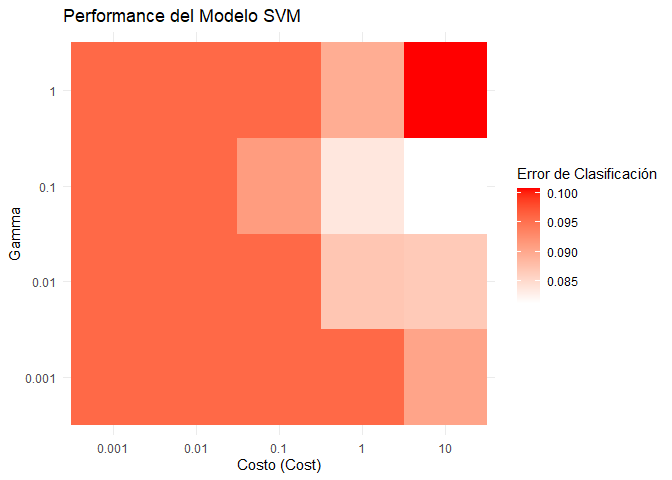
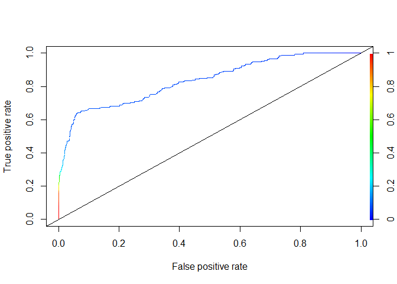
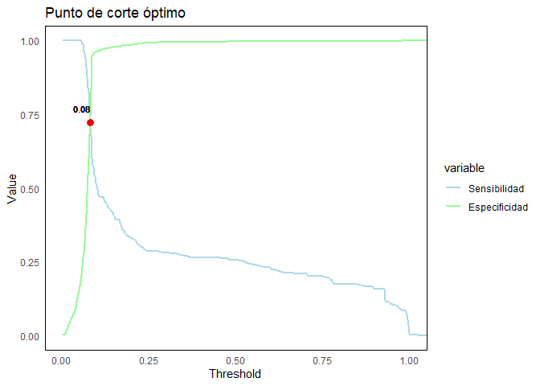
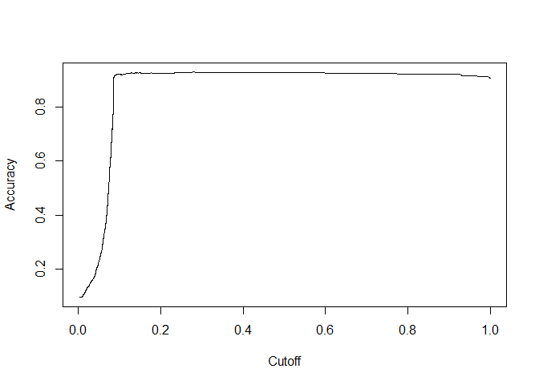
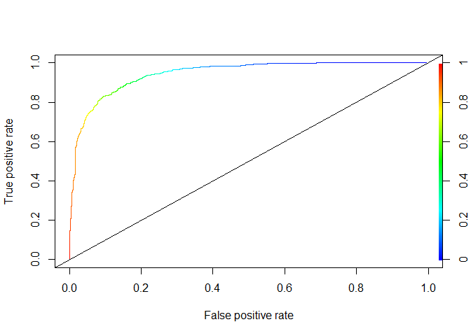
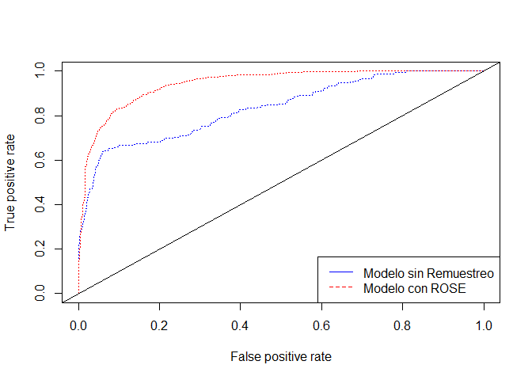
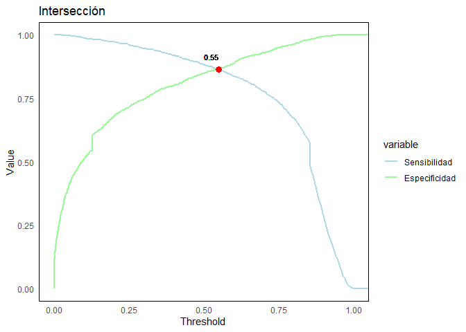

Proyecto de fin de módulo 6
================
Héctor Villegas
2024-08-09

*Librerías*

``` r
library(foreign)
library(dplyr)
library(caret)
library(ROCR)
library(e1071)
library(ROSE)
library(pROC)
library(knitr)
library(reshape2)
```

## Sección A

### Base de datos

``` r
datos <- read.spss(file="D:\\Programa ECD\\M6\\proyecto\\db\\ENV_2017.sav",
                   use.value.labels = F,
                   to.data.frame = T,
                   reencode = "UTF-8")
```

    ## re-encoding from UTF-8

``` r
head(datos) %>% 
  kable()
```

| prov_insc | cant_insc | parr_insc | anio_insc | mes_insc | dia_insc | fecha_insc | sexo | anio_nac | mes_nac | dia_nac | fecha_nac  | talla | peso | sem_gest | tipo_part | apgar1 | apgar5 | p_emb | lugar_ocur | prov_nac | cant_nac | parr_nac | area_nac | asis_por | nac_mad | cod_pais | anio_mad | mes_mad | dia_mad | fecha_mad  | edad_mad | con_pren | num_emb | num_par | hij_viv | hij_vivm | hij_nacm | etnia | est_civil | niv_inst | sabe_leer | prov_res | cant_res | parr_res | area_res | residente |
|:----------|:----------|:----------|----------:|---------:|---------:|:-----------|-----:|---------:|--------:|--------:|:-----------|------:|-----:|---------:|----------:|-------:|-------:|------:|-----------:|:---------|:---------|:---------|---------:|---------:|--------:|---------:|---------:|--------:|--------:|:-----------|---------:|---------:|--------:|--------:|--------:|---------:|---------:|------:|----------:|---------:|----------:|:---------|:---------|:---------|---------:|----------:|
| 24        | 2401      | 240102    |      2017 |       99 |       99 | 2017-99-99 |    2 |     2017 |       4 |       3 | 2017-04-03 |    99 |   99 |       99 |         9 |     99 |     99 |     9 |          7 | 24       | 2403     | 240352   |        2 |        7 |       9 |      999 |     9999 |      99 |      99 | 9999-99-99 |       99 |       99 |       1 |       1 |       1 |       99 |       99 |     9 |         9 |        9 |         9 | 24       | 2401     | 240102   |        1 |         2 |
| 24        | 2401      | 240102    |      2017 |       99 |       99 | 2017-99-99 |    1 |     2017 |       3 |      11 | 2017-03-11 |    99 |   99 |       99 |         9 |     99 |     99 |     9 |          7 | 24       | 2401     | 240102   |        1 |        7 |       9 |      999 |     9999 |      99 |      99 | 9999-99-99 |       99 |       99 |       1 |       1 |       1 |       99 |       99 |     9 |         9 |        9 |         9 | 24       | 2401     | 240102   |        1 |         1 |
| 24        | 2401      | 240102    |      2017 |       99 |       99 | 2017-99-99 |    1 |     2017 |       6 |      22 | 2017-06-22 |    99 |   99 |       99 |         9 |     99 |     99 |     9 |          7 | 24       | 2401     | 240102   |        1 |        7 |       9 |      999 |     9999 |      99 |      99 | 9999-99-99 |       99 |       99 |       1 |       1 |       1 |       99 |       99 |     9 |         9 |        9 |         9 | 24       | 2403     | 240350   |        1 |         2 |
| 24        | 2401      | 240102    |      2017 |       99 |       99 | 2017-99-99 |    1 |     2017 |       9 |       9 | 2017-09-09 |    99 |   99 |       99 |         9 |     99 |     99 |     9 |          7 | 24       | 2401     | 240102   |        1 |        7 |       9 |      999 |     9999 |      99 |      99 | 9999-99-99 |       99 |       99 |       1 |       1 |       1 |       99 |       99 |     9 |         9 |        9 |         9 | 24       | 2401     | 240152   |        2 |         2 |
| 24        | 2401      | 240102    |      2017 |       99 |       99 | 2017-99-99 |    1 |     2017 |       7 |      31 | 2017-07-31 |    99 |   99 |       99 |         9 |     99 |     99 |     9 |          7 | 24       | 2401     | 240102   |        1 |        7 |       9 |      999 |     9999 |      99 |      99 | 9999-99-99 |       99 |       99 |       1 |       1 |       1 |       99 |       99 |     9 |         9 |        9 |         9 | 24       | 2401     | 240102   |        1 |         1 |
| 24        | 2401      | 240102    |      2017 |       99 |       99 | 2017-99-99 |    1 |     2017 |       9 |       8 | 2017-09-08 |    99 |   99 |       99 |         9 |     99 |     99 |     9 |          7 | 24       | 2401     | 240102   |        1 |        7 |       9 |      999 |     9999 |      99 |      99 | 9999-99-99 |       99 |       99 |       1 |       1 |       1 |       99 |       99 |     9 |         9 |        9 |         9 | 24       | 2403     | 240352   |        2 |         2 |

Manipulación de base de datos:

``` r
datos$prov_nac <- as.numeric(as.character(datos$prov_nac))
```

Se seleccionaron las variables peso, talla, semana de gestación, sexo,
edad de la madre, la madre sabe leer y número de consultas prenatales.

``` r
env <- datos %>% 
  filter(prov_nac==13) %>% 
  select(peso, talla, sem_gest, sexo, edad_mad, sabe_leer, con_pren) %>% 
  filter(peso!=99, talla!=99, sem_gest!=99, con_pren!=99, sabe_leer!=99) %>% 
  mutate(peso=if_else(peso>2500, 1, 0),
         sexo=if_else(sexo==1, 0, 1),
         sabe_leer=if_else(sabe_leer==1, 1, 0),
         con_pren=if_else(con_pren>=7, 1, 0),
         edad2=edad_mad^2)

env$peso <- factor(env$peso)

env <- env %>% 
  mutate(peso=recode_factor(
    peso,
    `0`="no.adecuado",
    `1`="adecuado"))

env %>% 
  head() %>% 
  kable()
```

| peso     | talla | sem_gest | sexo | edad_mad | sabe_leer | con_pren | edad2 |
|:---------|------:|---------:|-----:|---------:|----------:|---------:|------:|
| adecuado |    52 |       40 |    1 |       19 |         1 |        0 |   361 |
| adecuado |    51 |       41 |    0 |       15 |         1 |        1 |   225 |
| adecuado |    49 |       40 |    1 |       27 |         1 |        1 |   729 |
| adecuado |    50 |       39 |    0 |       24 |         1 |        0 |   576 |
| adecuado |    50 |       39 |    1 |       19 |         1 |        1 |   361 |
| adecuado |    49 |       39 |    1 |       32 |         1 |        0 |  1024 |

``` r
table(env$peso)
```

    ## 
    ## no.adecuado    adecuado 
    ##        2299       21696

La base de datos está desbalanceada, hay más observaciones de la clase
*adecuado* que de la clase *no.adecuado*.

### División de datos

Se seleccionó el 10% para entrenamiento.

``` r
set.seed(1234)

train.set <- createDataPartition(env$peso,
                                     p=0.1,list=F)
```

### Tuning de hiperparámetros

``` r
modelos <- tune(svm, 
                peso~., 
                data=env[train.set, ], 
                ranges=list(cost=c(0.001, 0.01, 0.1, 1, 10),
                            gamma=c(0.001, 0.01, 0.1, 1)),
                scale=TRUE,
                probability=TRUE)


results <- modelos$performances
```

``` r
df_results <- as.data.frame(results)
df_results$cost <- factor(df_results$cost)
df_results$gamma <- factor(df_results$gamma)

# Graficar el rendimiento del modelo en función del costo y gamma
ggplot(df_results, aes(x=cost, y=gamma, fill=error)) +
  geom_tile() +
  scale_fill_gradient(low="white", high="red") +
  labs(title="Performance del Modelo SVM",
       x="Costo (Cost)",
       y="Gamma",
       fill="Error de Clasificación") +
  theme_minimal()
```

<!-- -->

El gráfico de calor muestra cómo varía el error de clasificación con
diferentes combinaciones de cost y gamma. Las combinaciones con colores
más oscuros indican un mayor error, mientras que los colores más claros
indican un mejor rendimiento. Se observa que la mejor combinación es
cost=10 y gamma=0.1.

``` r
modelo <- modelos$best.model

summary(modelo)
```

    ## 
    ## Call:
    ## best.tune(METHOD = svm, train.x = peso ~ ., data = env[train.set, 
    ##     ], ranges = list(cost = c(0.001, 0.01, 0.1, 1, 10), gamma = c(0.001, 
    ##     0.01, 0.1, 1)), scale = TRUE, probability = TRUE)
    ## 
    ## 
    ## Parameters:
    ##    SVM-Type:  C-classification 
    ##  SVM-Kernel:  radial 
    ##        cost:  10 
    ## 
    ## Number of Support Vectors:  485
    ## 
    ##  ( 281 204 )
    ## 
    ## 
    ## Number of Classes:  2 
    ## 
    ## Levels: 
    ##  no.adecuado adecuado

``` r
modelo$gamma
```

    ## [1] 0.1

## Sección B

### Matriz de clasificación

``` r
pred <- predict(modelo,
                env[train.set, ],
                type='prob',
                probability = T)
```

``` r
head(attr(pred, 'probabilities'), 5)
```

    ##     adecuado no.adecuado
    ## 24 0.9190421  0.08095786
    ## 37 0.9595010  0.04049903
    ## 40 0.9098654  0.09013459
    ## 43 0.9330957  0.06690428
    ## 55 0.9328741  0.06712591

``` r
levels(pred)
```

    ## [1] "no.adecuado" "adecuado"

``` r
levels(env$peso)
```

    ## [1] "no.adecuado" "adecuado"

La clase positiva es *adecuado*.

``` r
confusionMatrix(pred,
                env$peso[train.set],
                positive = levels(env$peso)[2])
```

    ## Confusion Matrix and Statistics
    ## 
    ##              Reference
    ## Prediction    no.adecuado adecuado
    ##   no.adecuado          59        5
    ##   adecuado            171     2165
    ##                                           
    ##                Accuracy : 0.9267          
    ##                  95% CI : (0.9155, 0.9368)
    ##     No Information Rate : 0.9042          
    ##     P-Value [Acc > NIR] : 6.064e-05       
    ##                                           
    ##                   Kappa : 0.3753          
    ##                                           
    ##  Mcnemar's Test P-Value : < 2.2e-16       
    ##                                           
    ##             Sensitivity : 0.9977          
    ##             Specificity : 0.2565          
    ##          Pos Pred Value : 0.9268          
    ##          Neg Pred Value : 0.9219          
    ##              Prevalence : 0.9042          
    ##          Detection Rate : 0.9021          
    ##    Detection Prevalence : 0.9733          
    ##       Balanced Accuracy : 0.6271          
    ##                                           
    ##        'Positive' Class : adecuado        
    ## 

- Rendimiento General: El modelo tiene una precisión bastante alta del
  93.0%. Esto sugiere que, en promedio, el modelo realiza un buen
  trabajo al clasificar las muestras.

- Clase Positiva (“adecuado”): El modelo tiene un alto rendimiento al
  identificar la clase “adecuado” con una sensitividad del 99.8%.

- Clase Negativa (“no.adecuado”): El modelo muestra una baja
  especificidad para la clase “no.adecuado” (25.7%). Esto indica que el
  modelo tiene problemas para identificar correctamente las instancias
  de “no.adecuado”, lo cual es consecuencia del desbalance de clases.

### Curva ROC

``` r
y <- prediction(attr(pred, "probabilities")[,2],
                   env$peso[train.set])

perf <- performance(y,"tpr","fpr")
plot(perf,colorize=T,lty=3)
abline(0,1,col="black")
```

<!-- -->

### Área bajo la curva

``` r
auc <- performance(y,measure = "auc")
auc@y.values[[1]]
```

    ## [1] 0.8349209

### Punto de corte óptimo

Se define la función plot.cutoff para encontrar el punto donde la
sensibilidad y la especificidad se cortan:

``` r
plot.cutoff <- function(prediction.obj, title) {
  
  # Obtener los valores de sensibilidad y especificidad
  perf <- performance(prediction.obj, "sens", "spec")
  sen <- slot(perf, "y.values")[[1]]
  esp <- slot(perf, "x.values")[[1]]
  alf <- slot(perf, "alpha.values")[[1]]
  
  # Obtener el punto de intersección
  diff <- abs(sen - esp)
  index <- which.min(diff)
  intersec_alf <- alf[index]
  intersec_value <- sen[index]
  
  # Crear el dataframe
  mat <- data.frame(alf, sen, esp)
  mat <- melt(mat, id.vars = "alf")
  
  # Crear el gráfico
  ggplot(mat) +
    aes(x = alf, y = value, group = variable, colour = variable) +
    geom_line(linewidth = 0.8) +
    geom_point(aes(x = intersec_alf, y = intersec_value), color = "red", size = 3) +
    geom_text(aes(x = intersec_alf, y = intersec_value, label = round(intersec_alf, 2)),
              vjust = -1.5, hjust = 1, color = "black", size = 3) +
    labs(
      title = title,
      x = 'Threshold',
      y = 'Value'
    ) +
    scale_color_manual(values = c("#ADD8E6", "#98FB98"),
                       labels = c('Sensibilidad', 'Especificidad')) +
    theme_minimal() +
    theme(
      panel.border = element_rect(color = "black", fill = NA, linewidth = 0.5),
      panel.grid.major = element_blank(),  # Eliminar la cuadrícula mayor
      panel.grid.minor = element_blank()   # Eliminar la cuadrícula menor
    )
}
```

``` r
plot.cutoff(y, 'Punto de corte óptimo')
```

<!-- -->

Como consecuencia del desequilibrio de datos se obtuvo un umbral muy
bajo el cual no es apropiado en este contexto para realizar la
clasificación. Se opta por encontrar el punto donde se maximiza el
accuracy.

``` r
max.accuracy <- performance(y,measure = "acc")
plot(max.accuracy)
```

<!-- -->

``` r
indice <- which.max(slot(max.accuracy,"y.values")[[1]])
acc <- slot(max.accuracy,"y.values")[[1]][indice]
cutoff <- slot(max.accuracy,"x.values")[[1]][indice]

c(accuracy=acc, cutoff=cutoff)
```

    ##    accuracy cutoff.4044 
    ##   0.9275000   0.2791884

### Evaluación con punto de corte óptimo

``` r
cutoff <- 0.28
pred_binary <- ifelse(attr(pred, 'probabilities')[, 1] >= cutoff, levels(env$peso)[2], levels(env$peso)[1])
pred_binary <- factor(pred_binary, levels = levels(env$peso))

confusionMatrix(pred_binary, env$peso[train.set], positive = levels(env$peso)[2])
```

    ## Confusion Matrix and Statistics
    ## 
    ##              Reference
    ## Prediction    no.adecuado adecuado
    ##   no.adecuado          46        2
    ##   adecuado            184     2168
    ##                                           
    ##                Accuracy : 0.9225          
    ##                  95% CI : (0.9111, 0.9329)
    ##     No Information Rate : 0.9042          
    ##     P-Value [Acc > NIR] : 0.0009692       
    ##                                           
    ##                   Kappa : 0.308           
    ##                                           
    ##  Mcnemar's Test P-Value : < 2.2e-16       
    ##                                           
    ##             Sensitivity : 0.9991          
    ##             Specificity : 0.2000          
    ##          Pos Pred Value : 0.9218          
    ##          Neg Pred Value : 0.9583          
    ##              Prevalence : 0.9042          
    ##          Detection Rate : 0.9033          
    ##    Detection Prevalence : 0.9800          
    ##       Balanced Accuracy : 0.5995          
    ##                                           
    ##        'Positive' Class : adecuado        
    ## 

El punto de corte óptimo mejora ligeramente la sensibilidad. Sin
embargo, también lleva a una disminución en la especificidad y una
ligera disminución en la exactitud general y la precisión balanceada.

### Predicción

Generando nueva observación:

``` r
new_data <- data.frame(
  talla=43,
  sem_gest=35,  
  sexo=1,
  edad_mad=25,  
  sabe_leer=1,
  con_pren=1,
  edad2=625
)
```

Predicción:

``` r
pred_prob <- predict(modelo, new_data, type = 'prob', probability = T)
```

Aplicando punto de corte al 0.5:

``` r
cutoff_default <- 0.5
pred_binary_default <- ifelse(attr(pred_prob, 'probabilities')[, 1] >= cutoff_default, 
                              levels(env$peso)[2], 
                              levels(env$peso)[1])

cat("Predicción con punto de corte al 0.5:", pred_binary_default)
```

    ## Predicción con punto de corte al 0.5: no.adecuado

Aplicando punto de corte óptimo:

``` r
pred_binary_optimal <- ifelse(attr(pred_prob, 'probabilities')[, 1] >= cutoff, 
                              levels(env$peso)[2], 
                              levels(env$peso)[1])

cat("Predicción con punto de corte óptimo (0.28):", pred_binary_optimal)
```

    ## Predicción con punto de corte óptimo (0.28): no.adecuado

- Predicción con Punto de Corte por Defecto (0.5):

Si la probabilidad de la clase positiva es mayor o igual a 0.5, el nuevo
vector se clasifica como la clase positiva.\\ Si la probabilidad es
menor a 0.5, se clasifica como la clase negativa.

-Predicción con Punto de Corte Óptimo (0.28):

Si la probabilidad de la clase positiva es mayor o igual a 0.38, el
nuevo vector se clasifica como la clase positiva.\\ Si la probabilidad
es menor a 0.28, se clasifica como la clase negativa.

## Sección C

### Remuestreo con ROSE

``` r
train.data <- env[train.set, ]

data.rose  <- ROSE(peso ~., data = train.data, seed = 1)$data
table(data.rose$peso)
```

    ## 
    ##    adecuado no.adecuado 
    ##        1251        1149

``` r
svm.rose <- tune(svm, 
     peso~., 
     data=data.rose,
     ranges=list(cost=c(0.001, 0.01, 0.1, 1, 10),
                gamma=c(0.001, 0.01, 0.1, 1)),
     kernel='radial',
     scale=T,
     probability=TRUE
     )

summary(svm.rose)
```

    ## 
    ## Parameter tuning of 'svm':
    ## 
    ## - sampling method: 10-fold cross validation 
    ## 
    ## - best parameters:
    ##  cost gamma
    ##    10   0.1
    ## 
    ## - best performance: 0.1729167 
    ## 
    ## - Detailed performance results:
    ##     cost gamma     error dispersion
    ## 1  1e-03 0.001 0.4787500 0.02119592
    ## 2  1e-02 0.001 0.4787500 0.02119592
    ## 3  1e-01 0.001 0.4454167 0.02495753
    ## 4  1e+00 0.001 0.2841667 0.02272012
    ## 5  1e+01 0.001 0.2754167 0.01929006
    ## 6  1e-03 0.010 0.4787500 0.02119592
    ## 7  1e-02 0.010 0.4616667 0.02203042
    ## 8  1e-01 0.010 0.2837500 0.02564372
    ## 9  1e+00 0.010 0.2650000 0.01725803
    ## 10 1e+01 0.010 0.2437500 0.02326130
    ## 11 1e-03 0.100 0.4787500 0.02119592
    ## 12 1e-02 0.100 0.2916667 0.03167154
    ## 13 1e-01 0.100 0.2583333 0.02421611
    ## 14 1e+00 0.100 0.2187500 0.02043603
    ## 15 1e+01 0.100 0.1729167 0.02415629
    ## 16 1e-03 1.000 0.4787500 0.02119592
    ## 17 1e-02 1.000 0.4787500 0.02119592
    ## 18 1e-01 1.000 0.2370833 0.01898769
    ## 19 1e+00 1.000 0.2025000 0.01598128
    ## 20 1e+01 1.000 0.2262500 0.02576380

``` r
mejor.modelo.rose <- svm.rose$best.model

pred.rose <- predict(mejor.modelo.rose, data.rose, type = 'prob', probability = T)

head(attr(pred.rose, 'probabilities'))
```

    ##    adecuado no.adecuado
    ## 1 0.9217168  0.07828323
    ## 2 0.8728805  0.12711947
    ## 3 0.8728195  0.12718049
    ## 4 0.9546694  0.04533056
    ## 5 0.9010803  0.09891974
    ## 6 0.9182665  0.08173350

``` r
levels(pred.rose)
```

    ## [1] "adecuado"    "no.adecuado"

``` r
levels(data.rose$peso)
```

    ## [1] "adecuado"    "no.adecuado"

``` r
confusionMatrix(pred.rose, data.rose$peso, positive = levels(pred.rose)[1])
```

    ## Confusion Matrix and Statistics
    ## 
    ##              Reference
    ## Prediction    adecuado no.adecuado
    ##   adecuado        1061         135
    ##   no.adecuado      190        1014
    ##                                          
    ##                Accuracy : 0.8646         
    ##                  95% CI : (0.8502, 0.878)
    ##     No Information Rate : 0.5212         
    ##     P-Value [Acc > NIR] : < 2.2e-16      
    ##                                          
    ##                   Kappa : 0.7292         
    ##                                          
    ##  Mcnemar's Test P-Value : 0.002741       
    ##                                          
    ##             Sensitivity : 0.8481         
    ##             Specificity : 0.8825         
    ##          Pos Pred Value : 0.8871         
    ##          Neg Pred Value : 0.8422         
    ##              Prevalence : 0.5212         
    ##          Detection Rate : 0.4421         
    ##    Detection Prevalence : 0.4983         
    ##       Balanced Accuracy : 0.8653         
    ##                                          
    ##        'Positive' Class : adecuado       
    ## 

``` r
y.rose <- prediction(attr(pred.rose, "probabilities")[, 2], data.rose$peso)

perf.rose <- performance(y.rose,"tpr","fpr")

plot(perf.rose,colorize=T,lty=3)
abline(0,1,col="black")
```

<!-- -->

``` r
auc.rose <- performance(y.rose,measure = "auc")
auc.rose@y.values[[1]]
```

    ## [1] 0.9447801

### Curvas ROC

``` r
plot(perf,col='blue',lty=3)
plot(perf.rose,col='red',lty=3, add=T)
abline(0,1,col="black")
legend("bottomright", legend = c("Modelo sin Remuestreo", "Modelo con ROSE"),
       col = c("blue", "red"), lty = c(1, 2))
```

<!-- -->

### Punto de corte óptimo

``` r
plot.cutoff(y.rose, 'Intersección')
```

<!-- -->

### Predicciones

``` r
new_data
```

    ##   talla sem_gest sexo edad_mad sabe_leer con_pren edad2
    ## 1    43       35    1       25         1        1   625

Predicción de modelo con remuestreo aplicando punto de corte óptimo:

``` r
pred.rose <- predict(mejor.modelo.rose, new_data, type = 'prob', probability = T)

pred.binary.rose <- ifelse(attr(pred.rose, 'probabilities')[, 1] >= 0.55, 
                              levels(env$peso)[2], 
                              levels(env$peso)[1])

pred.binary.rose
```

    ## [1] "no.adecuado"

Predicción de modelo sin remuestreo aplicando punto de corte óptimo:

``` r
pred_binary_optimal
```

    ## [1] "no.adecuado"

``` r
results <- data.frame(
  pred_no_resampling = pred_binary_optimal,
  pred_rose = pred.binary.rose,
  stringsAsFactors = FALSE
)

results
```

    ##   pred_no_resampling   pred_rose
    ## 1        no.adecuado no.adecuado

### Conclusiones

- Mejora en la Balanced Accuracy:

El modelo remuestreado muestra una Balanced Accuracy significativamente
mejor (86.53%) en comparación con el modelo sin remuestreo (62.71%).
Esto indica que el remuestreo ha mejorado el equilibrio en la capacidad
del modelo para clasificar tanto los casos positivos como los negativos.
Un mejor equilibrio entre sensibilidad y especificidad sugiere que el
modelo remuestreado es más robusto en la identificación de ambas clases.

- Aumento en el Kappa:

El valor de Kappa para el modelo remuestreado (0.7292) es
considerablemente más alto que el del modelo sin remuestreo (0.3753).
Esto refleja una mejor concordancia entre las predicciones y las
verdaderas clases, ajustada por el azar. Un Kappa más alto indica que el
remuestreo ha ayudado a mejorar la calidad general del modelo.

- Mejora en Specificity:

La especificidad del modelo remuestreado (88.25%) es notablemente más
alta que la del modelo sin remuestreo (25.65%). Esto significa que el
modelo remuestreado es más efectivo en identificar correctamente los
casos negativos (“no.adecuado”). La mejora en la especificidad es un
indicativo de que el remuestreo ha ayudado a reducir el número de falsos
positivos.

- Mejora en el AUC:

El Área Bajo la Curva (AUC) para el modelo remuestreado es 0.94,
mientras que para el modelo sin remuestreo es 0.83. Un AUC más alto
indica una mejor capacidad del modelo para distinguir entre las clases.
La mejora en el AUC sugiere que el remuestreo ha permitido al modelo
capturar mejor las características distintivas entre las clases,
resultando en una mejor capacidad de clasificación general.
