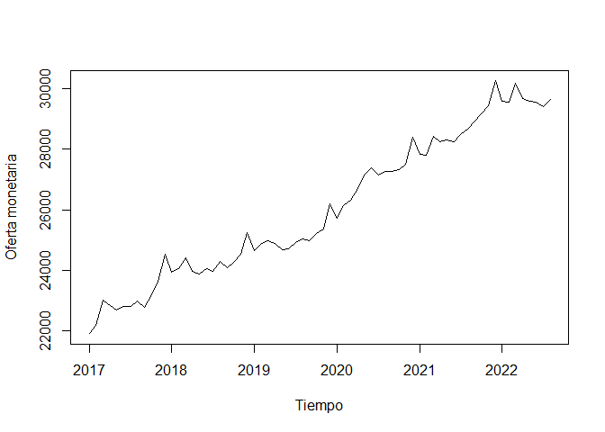
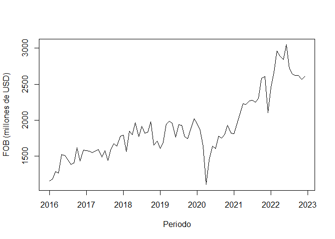
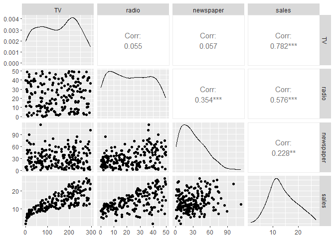
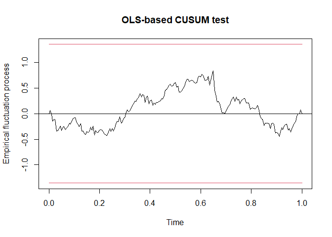
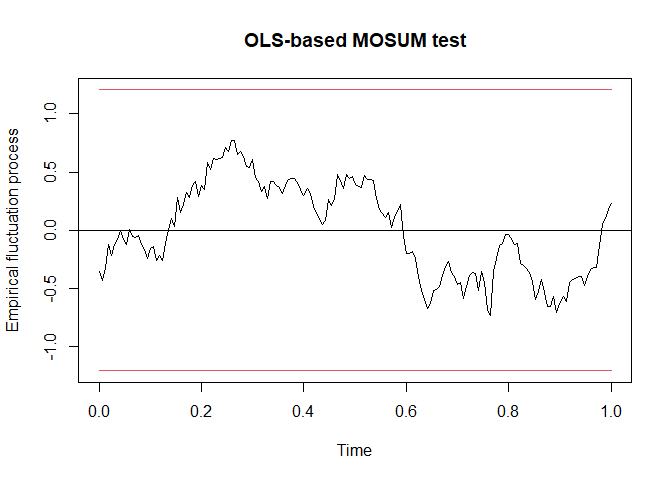

Proyecto de fin de módulo 3
================
Héctor Villegas
2024-04-28

*Librerías utilizadas*

``` r
library(forecast)
library(openxlsx)
library(dplyr)
library(tidyr)
library(knitr)
library(lmtest)
library(GGally)
library(car)
library(moments)
library(ggplot2)
library(nlme)
library(sandwich)
library(strucchange)
```

## Sección A.-

### 1- Tasa de crecimiento de la oferta monetaria

Se utilizó una base de datos de oferta monetaria del Banco Central del
periodo enero del 2017 a agosto del 2022 con frecuencia mensual.

``` r

datos_om <-  read.xlsx("D:\\Programa ECD\\M3\\proyecto\\db\\Oferta Monetaria (M1) y Liquidez Total (M2) - Mensual (1).xlsx", startRow = 6)

datos_om %>% 
  head() %>% 
  kable()
```

| X1   | X2     | Especies.Monetarias.en.Circulación | Liquidez.Total.M2 | Oferta.Monetaria.M1 |
|:-----|:-------|-----------------------------------:|------------------:|--------------------:|
| 2022 | Agosto |                           18588.49 |          72494.98 |            29650.81 |
| 2022 | Julio  |                           18550.73 |          71671.62 |            29414.37 |
| 2022 | Junio  |                           18555.11 |          71391.04 |            29541.45 |
| 2022 | Mayo   |                           18436.59 |          71141.79 |            29594.13 |
| 2022 | Abril  |                           18559.34 |          70908.39 |            29664.74 |
| 2022 | Marzo  |                           18360.04 |          71033.33 |            30176.47 |

Se modificó la base de datos para convertir a serie de tiempo y generar
la gráfica:

``` r
db_om <- datos_om %>% 
  mutate(X1=as.numeric(X1))

meses <- c('Enero', 'Febrero', 'Marzo', 'Abril', 'Mayo', 'Junio',
           'Julio', 'Agosto', 'Septiembre', 'Octubre', 'Noviembre', 'Diciembre')

db_om$X2 <-  match(trimws(db_om$X2), meses)

db_om <- db_om %>% 
  arrange(X1, X2) %>% 
  na.omit() %>% 
  rename(EMC=Especies.Monetarias.en.Circulación,
         LT=Liquidez.Total.M2,
         OM=Oferta.Monetaria.M1)
  
tsom <- ts(db_om[,3:5], start = c(2017, 1), frequency = 12)

tsom %>% 
  head()
```

    ##               EMC       LT       OM
    ## Jan 2017 12979.48 45257.48 21912.19
    ## Feb 2017 13147.25 45980.08 22193.52
    ## Mar 2017 13301.04 47075.93 23032.94
    ## Apr 2017 13582.73 47310.79 22842.30
    ## May 2017 13642.39 47129.41 22703.75
    ## Jun 2017 13730.20 47586.69 22824.91

``` r
plot(tsom[, 'OM'], ylab='Oferta monetaria', xlab='Tiempo')
```



Implementación del modelo:

``` r
tasa_om <- tslm(log(tsom[, 'OM']) ~ trend, data=tsom)
summary(tasa_om)
```

    ## 
    ## Call:
    ## tslm(formula = log(tsom[, "OM"]) ~ trend, data = tsom)
    ## 
    ## Residuals:
    ##       Min        1Q    Median        3Q       Max 
    ## -0.031017 -0.008580 -0.000484  0.007146  0.046174 
    ## 
    ## Coefficients:
    ##              Estimate Std. Error t value Pr(>|t|)    
    ## (Intercept) 1.001e+01  3.928e-03 2547.80   <2e-16 ***
    ## trend       4.558e-03  9.895e-05   46.06   <2e-16 ***
    ## ---
    ## Signif. codes:  0 '***' 0.001 '**' 0.01 '*' 0.05 '.' 0.1 ' ' 1
    ## 
    ## Residual standard error: 0.01602 on 66 degrees of freedom
    ## Multiple R-squared:  0.9698, Adjusted R-squared:  0.9694 
    ## F-statistic:  2121 on 1 and 66 DF,  p-value: < 2.2e-16

Cálculo de la tasa de crecimiento:

``` r
(exp(tasa_om$coefficients[2])-1)*100
```

    ##     trend 
    ## 0.4567982

La tasa de crecimiento de la oferta monetaria es del 0.46% mensual entre
enero del 2017 y agosto del 2022.

### 2- Tasa de crecimiento de las exportaciones

Se utilizó una base de datos de exportaciones por aduana tomada del
Banco Central del periodo de enero del 2016 a diciembre del 2022:

``` r

datos_ex <-  read.xlsx("D:\\Programa ECD\\M3\\proyecto\\db\\04. Export. o Import. por Aduana.xlsx", startRow = 7)

datos_ex %>% 
  head() %>% 
  kable()
```

| X1            | X2                   | 2016./.01.-.Ene   | X4               | 2016./.02.-.Feb   | X6             | 2016./.03.-.Mar   | X8               | 2016./.04.-.Abr   | X10            | 2016./.05.-.May   | X12           | 2016./.06.-.Jun   | X14            | 2016./.07.-.Jul   | X16              | 2016./.08.-.Ago   | X18              | 2016./.09.-.Sep   | X20           | 2016./.10.-.Oct   | X22              | 2016./.11.-.Nov   | X24            | 2016./.12.-.Dic   | X26              | 2017./.01.-.Ene   | X28              | 2017./.02.-.Feb   | X30            | 2017./.03.-.Mar   | X32              | 2017./.04.-.Abr   | X34              | 2017./.05.-.May   | X36              | 2017./.06.-.Jun   | X38            | 2017./.07.-.Jul   | X40              | 2017./.08.-.Ago   | X42            | 2017./.09.-.Sep   | X44              | 2017./.10.-.Oct   | X46              | 2017./.11.-.Nov   | X48              | 2017./.12.-.Dic   | X50            | 2018./.01.-.Ene   | X52              | 2018./.02.-.Feb   | X54              | 2018./.03.-.Mar   | X56              | 2018./.04.-.Abr   | X58              | 2018./.05.-.May   | X60              | 2018./.06.-.Jun   | X62            | 2018./.07.-.Jul   | X64              | 2018./.08.-.Ago   | X66              | 2018./.09.-.Sep   | X68              | 2018./.10.-.Oct   | X70              | 2018./.11.-.Nov   | X72              | 2018./.12.-.Dic   | X74              | 2019./.01.-.Ene   | X76              | 2019./.02.-.Feb   | X78              | 2019./.03.-.Mar   | X80              | 2019./.04.-.Abr   | X82              | 2019./.05.-.May   | X84              | 2019./.06.-.Jun   | X86            | 2019./.07.-.Jul   | X88              | 2019./.08.-.Ago   | X90            | 2019./.09.-.Sep   | X92              | 2019./.10.-.Oct   | X94              | 2019./.11.-.Nov   | X96            | 2019./.12.-.Dic   | X98              | 2020./.01.-.Ene   | X100             | 2020./.02.-.Feb   | X102           | 2020./.03.-.Mar   | X104             | 2020./.04.-.Abr   | X106          | 2020./.05.-.May   | X108             | 2020./.06.-.Jun   | X110             | 2020./.07.-.Jul   | X112             | 2020./.08.-.Ago   | X114           | 2020./.09.-.Sep   | X116             | 2020./.10.-.Oct   | X118           | 2020./.11.-.Nov   | X120           | 2020./.12.-.Dic   | X122             | 2021./.01.-.Ene   | X124             | 2021./.02.-.Feb   | X126             | 2021./.03.-.Mar   | X128           | 2021./.04.-.Abr   | X130             | 2021./.05.-.May   | X132             | 2021./.06.-.Jun   | X134           | 2021./.07.-.Jul    | X136             | 2021./.08.-.Ago   | X138             | 2021./.09.-.Sep   | X140           | 2021./.10.-.Oct   | X142             | 2021./.11.-.Nov   | X144             | 2021./.12.-.Dic   | X146             | 2022./.01.-.Ene   | X148             | 2022./.02.-.Feb   | X150           | 2022./.03.-.Mar   | X152             | 2022./.04.-.Abr   | X154             | 2022./.05.-.May   | X156             | 2022./.06.-.Jun   | X158             | 2022./.07.-.Jul    | X160             | 2022./.08.-.Ago   | X162             | 2022./.09.-.Sep   | X164           | 2022./.10.-.Oct   | X166           | 2022./.11.-.Nov   | X168           | 2022./.12.-.Dic   | X170             |
|:--------------|:---------------------|:------------------|:-----------------|:------------------|:---------------|:------------------|:-----------------|:------------------|:---------------|:------------------|:--------------|:------------------|:---------------|:------------------|:-----------------|:------------------|:-----------------|:------------------|:--------------|:------------------|:-----------------|:------------------|:---------------|:------------------|:-----------------|:------------------|:-----------------|:------------------|:---------------|:------------------|:-----------------|:------------------|:-----------------|:------------------|:-----------------|:------------------|:---------------|:------------------|:-----------------|:------------------|:---------------|:------------------|:-----------------|:------------------|:-----------------|:------------------|:-----------------|:------------------|:---------------|:------------------|:-----------------|:------------------|:-----------------|:------------------|:-----------------|:------------------|:-----------------|:------------------|:-----------------|:------------------|:---------------|:------------------|:-----------------|:------------------|:-----------------|:------------------|:-----------------|:------------------|:-----------------|:------------------|:-----------------|:------------------|:-----------------|:------------------|:-----------------|:------------------|:-----------------|:------------------|:-----------------|:------------------|:-----------------|:------------------|:-----------------|:------------------|:---------------|:------------------|:-----------------|:------------------|:---------------|:------------------|:-----------------|:------------------|:-----------------|:------------------|:---------------|:------------------|:-----------------|:------------------|:-----------------|:------------------|:---------------|:------------------|:-----------------|:------------------|:--------------|:------------------|:-----------------|:------------------|:-----------------|:------------------|:-----------------|:------------------|:---------------|:------------------|:-----------------|:------------------|:---------------|:------------------|:---------------|:------------------|:-----------------|:------------------|:-----------------|:------------------|:-----------------|:------------------|:---------------|:------------------|:-----------------|:------------------|:-----------------|:------------------|:---------------|:-------------------|:-----------------|:------------------|:-----------------|:------------------|:---------------|:------------------|:-----------------|:------------------|:-----------------|:------------------|:-----------------|:------------------|:-----------------|:------------------|:---------------|:------------------|:-----------------|:------------------|:-----------------|:------------------|:-----------------|:------------------|:-----------------|:-------------------|:-----------------|:------------------|:-----------------|:------------------|:---------------|:------------------|:---------------|:------------------|:---------------|:------------------|:-----------------|
| Código Aduana | Aduana               | TM (Peso Neto)    | FOB              | TM (Peso Neto)    | FOB            | TM (Peso Neto)    | FOB              | TM (Peso Neto)    | FOB            | TM (Peso Neto)    | FOB           | TM (Peso Neto)    | FOB            | TM (Peso Neto)    | FOB              | TM (Peso Neto)    | FOB              | TM (Peso Neto)    | FOB           | TM (Peso Neto)    | FOB              | TM (Peso Neto)    | FOB            | TM (Peso Neto)    | FOB              | TM (Peso Neto)    | FOB              | TM (Peso Neto)    | FOB            | TM (Peso Neto)    | FOB              | TM (Peso Neto)    | FOB              | TM (Peso Neto)    | FOB              | TM (Peso Neto)    | FOB            | TM (Peso Neto)    | FOB              | TM (Peso Neto)    | FOB            | TM (Peso Neto)    | FOB              | TM (Peso Neto)    | FOB              | TM (Peso Neto)    | FOB              | TM (Peso Neto)    | FOB            | TM (Peso Neto)    | FOB              | TM (Peso Neto)    | FOB              | TM (Peso Neto)    | FOB              | TM (Peso Neto)    | FOB              | TM (Peso Neto)    | FOB              | TM (Peso Neto)    | FOB            | TM (Peso Neto)    | FOB              | TM (Peso Neto)    | FOB              | TM (Peso Neto)    | FOB              | TM (Peso Neto)    | FOB              | TM (Peso Neto)    | FOB              | TM (Peso Neto)    | FOB              | TM (Peso Neto)    | FOB              | TM (Peso Neto)    | FOB              | TM (Peso Neto)    | FOB              | TM (Peso Neto)    | FOB              | TM (Peso Neto)    | FOB              | TM (Peso Neto)    | FOB            | TM (Peso Neto)    | FOB              | TM (Peso Neto)    | FOB            | TM (Peso Neto)    | FOB              | TM (Peso Neto)    | FOB              | TM (Peso Neto)    | FOB            | TM (Peso Neto)    | FOB              | TM (Peso Neto)    | FOB              | TM (Peso Neto)    | FOB            | TM (Peso Neto)    | FOB              | TM (Peso Neto)    | FOB           | TM (Peso Neto)    | FOB              | TM (Peso Neto)    | FOB              | TM (Peso Neto)    | FOB              | TM (Peso Neto)    | FOB            | TM (Peso Neto)    | FOB              | TM (Peso Neto)    | FOB            | TM (Peso Neto)    | FOB            | TM (Peso Neto)    | FOB              | TM (Peso Neto)    | FOB              | TM (Peso Neto)    | FOB              | TM (Peso Neto)    | FOB            | TM (Peso Neto)    | FOB              | TM (Peso Neto)    | FOB              | TM (Peso Neto)    | FOB            | TM (Peso Neto)     | FOB              | TM (Peso Neto)    | FOB              | TM (Peso Neto)    | FOB            | TM (Peso Neto)    | FOB              | TM (Peso Neto)    | FOB              | TM (Peso Neto)    | FOB              | TM (Peso Neto)    | FOB              | TM (Peso Neto)    | FOB            | TM (Peso Neto)    | FOB              | TM (Peso Neto)    | FOB              | TM (Peso Neto)    | FOB              | TM (Peso Neto)    | FOB              | TM (Peso Neto)     | FOB              | TM (Peso Neto)    | FOB              | TM (Peso Neto)    | FOB            | TM (Peso Neto)    | FOB            | TM (Peso Neto)    | FOB            | TM (Peso Neto)    | FOB              |
| TOTALES:      | NA                   | 2.7382239514695e6 | 1157.106346867   | 2.3745291770135e6 | 1185.390969454 | 2.5844695496052e6 | 1284.689169364   | 2.4448392848603e6 | 1263.638898581 | 2.9026389338082e6 | 1525.12767246 | 2.7828322146461e6 | 1508.769597381 | 2.9148850270124e6 | 1443.55262848    | 2.5916095365487e6 | 1385.04691654    | 2.5352566859537e6 | 1406.64781323 | 2.8592113268545e6 | 1618.429220775   | 2.5468910497923e6 | 1431.804001691 | 2.6655566397051e6 | 1587.46309759    | 2.7514410677903e6 | 1575.674972732   | 2.6491837411033e6 | 1574.006204911 | 2.6294313242863e6 | 1550.918886662   | 2.6642977317064e6 | 1570.431411117   | 2.6958189475842e6 | 1594.652070963   | 2.6364674374172e6 | 1488.016911353 | 2.7248950290901e6 | 1576.155377062   | 2.5207462493482e6 | 1441.219938135 | 2.6943679477842e6 | 1599.219161858   | 2.5968697700201e6 | 1674.808832958   | 2.5187811408741e6 | 1641.573894071   | 2.5740015005492e6 | 1779.287095145 | 2.7760061272821e6 | 1793.625457963   | 2.2356009694041e6 | 1561.164861529   | 2.7057350865601e6 | 1847.681078078   | 2.5179842945262e6 | 1802.655368862   | 2.7443985737051e6 | 1961.963815947   | 2.5729984053181e6 | 1769.734981799 | 2.6212928001161e6 | 1915.489128735   | 2.6906593315831e6 | 1819.656373501   | 2.5759221947382e6 | 1832.385982517   | 2.6122072457622e6 | 1980.590757574   | 2.4499173172642e6 | 1656.040994807   | 2.7364566944151e6 | 1711.160784284   | 2.5801157727121e6 | 1602.185493269   | 2.4552002787011e6 | 1695.155974309   | 2.8412295917801e6 | 1947.294329911   | 2.8776656165322e6 | 1988.979785806   | 2.7805433603921e6 | 1956.094790248   | 2.5368260747077e6 | 1765.140133243 | 2.8123421160624e6 | 1939.338777894   | 2.9343519122054e6 | 1931.604397228 | 2.6703101016778e6 | 1768.104934301   | 2.7436936068442e6 | 1741.895549513   | 2.7053897590713e6 | 1878.064291658 | 2.9497310566821e6 | 2020.131024998   | 2.9464820210881e6 | 1951.452653515   | 2.5542078481971e6 | 1859.709897878 | 3.2513528723071e6 | 1641.67576457    | 1.7064142775054e6 | 1105.25589581 | 2.1843601561414e6 | 1448.189817692   | 2.7551177966552e6 | 1637.077490723   | 2.6323519937822e6 | 1605.173438523   | 2.9429922914452e6 | 1779.813560288 | 2.9646222782783e6 | 1750.724996821   | 2.7848243023451e6 | 1799.96894687  | 2.9321164642921e6 | 1932.393963877 | 2.9439601828071e6 | 1822.450015127   | 2.8075781825861e6 | 1814.891832808   | 2.6410469257792e6 | 1953.825093096   | 2.8292680560361e6 | 2092.602235645 | 2.7921702117742e6 | 2231.090307968   | 2.8891354838222e6 | 2221.076543858   | 2.7152504071272e6 | 2272.867541304 | 2.74933658680831e6 | 2277.119003787   | 2.8122030555453e6 | 2245.30002227    | 2.5679002196561e6 | 2302.145285921 | 2.9567482862651e6 | 2577.654438026   | 2.8163311071621e6 | 2608.255229425   | 1.8744590112961e6 | 2102.472793844   | 2.4262921386021e6 | 2455.569303262   | 2.4510578584821e6 | 2666.856625915 | 2.7789758855861e6 | 2962.658491484   | 2.7997855385222e6 | 2891.725005564   | 2.6167125529173e6 | 2844.020577468   | 2.6575630278202e6 | 3047.762830479   | 2.54054281924821e6 | 2721.825616182   | 2.7073244802492e6 | 2642.473056025   | 2.7449022943011e6 | 2625.267585629 | 2.6407731457641e6 | 2623.651491251 | 2.6565916317811e6 | 2570.087201333 | 2.9600963792741e6 | 2606.366435503   |
| 019           | GUAYAQUIL - AEREO    | 951.1754871       | 34.255796228     | 740.105305        | 33.749299717   | 877.627818999999  | 41.7624065       | 761.142537        | 32.72101369    | 979.371845        | 33.169862492  | 1067.1337812      | 26.237987948   | 1099.5167602      | 31.2689913350001 | 841.8824551       | 27.9516150670001 | 779.1720072       | 31.154602599  | 1134.573803       | 28.435014539     | 939.656764100001  | 25.733576155   | 773.616217        | 28.107311017     | 860.262484999999  | 19.183116297     | 720.212478        | 16.975922505   | 740.14795         | 28.773263565     | 788.418702000001  | 24.681724654     | 787.760704        | 24.874417813     | 637.881168        | 19.365214705   | 809.740465        | 20.976367507     | 805.989921        | 25.052845868   | 743.463670000001  | 18.888006572     | 1231.568924       | 22.233058801     | 918.760880999999  | 23.526532865     | 986.390229000001  | 20.941718315   | 1350.356371       | 25.181480227     | 1446.887897       | 24.240776872     | 1369.81189        | 29.9449255090001 | 1411.416209       | 28.911919328     | 1379.938389       | 31.3535545980001 | 1119.937101       | 25.334127214   | 1166.086172       | 25.931479629     | 1417.812466       | 31.913237279     | 1126.883668       | 18.886431737     | 1007.553888       | 24.546040677     | 826.007467        | 19.063913175     | 846.077178        | 23.495453025     | 1251.687187       | 23.675489055     | 2182.054332       | 26.505720182     | 2072.546811       | 31.234122078     | 1490.951308       | 27.061083403     | 1419.442508       | 27.161727972     | 1514.475835       | 22.497139383   | 1514.45497        | 33.835702677     | 1490.758513       | 44.570959846   | 734.606719        | 25.974038532     | 1540.482477       | 32.3570522359999 | 2405.3458712      | 35.535812448   | 1261.968355       | 34.9441316820001 | 2005.612316       | 53.75309318      | 2638.108625       | 45.6657256     | 1902.105889       | 49.285549965     | 755.171403        | 27.73243058   | 1021.221287       | 33.02092504      | 785.963198000001  | 31.841805472     | 1203.755147       | 43.592835643     | 787.82599         | 53.517230554   | 814.846841999999  | 55.9985896480001 | 1232.683499       | 44.01077079    | 1280.879637       | 79.52438417    | 936.097664        | 52.54033376      | 1221.743804       | 54.7794183       | 1959.661852       | 56.2403846       | 1107.64573        | 44.929265162   | 1281.702207       | 72.2287030000002 | 1187.803797       | 56.8717157680001 | 1542.889419       | 49.18576541    | 1169.680798        | 55.8324672299999 | 1367.035567       | 54.1858305480001 | 1653.387184       | 62.83901713    | 1383.537095       | 73.8878412430001 | 1870.520451       | 50.4166203430001 | 1274.157783       | 89.4015575330002 | 1447.882414       | 74.3902733980001 | 1238.980419       | 91.887439187   | 1901.502452       | 75.2577516930001 | 1898.188136       | 73.4762780660002 | 1587.252501       | 62.7425362700001 | 1030.167465       | 79.2670503669999 | 854.478570000001   | 87.2051700590002 | 743.906203        | 91.4113029750001 | 1137.523165       | 71.314278867   | 1224.140697       | 81.52242165    | 865.960674        | 97.235947278   | 976.320859000001  | 87.0825538050002 |
| 028           | GUAYAQUIL - MARITIMO | 596396.313813301  | 654.054765438999 | 577241.1950021    | 646.880282162  | 592195.977294901  | 668.228168387999 | 610233.4343312    | 648.881911917  | 634310.122746101  | 747.699618752 | 576827.833172398  | 701.890946197  | 607290.842837001  | 702.898686151    | 599938.5040484    | 697.728787082999 | 555462.1379732    | 686.901692029 | 738679.743854101  | 824.434634261001 | 577428.742534     | 726.918035074  | 675621.853979     | 786.543159594998 | 774447.7362111    | 793.399226224999 | 646712.916998201  | 738.798525893  | 646206.082154201  | 773.328880603002 | 650861.9442331    | 785.429110138001 | 675339.89406      | 807.017941777001 | 616491.665233001  | 735.057616379  | 697905.081563     | 836.845782846999 | 610184.726819002  | 713.127433112  | 594781.240021     | 729.577252930999 | 702185.783944999  | 850.247253591999 | 604020.064026     | 766.197516265001 | 722449.108429     | 906.265487125  | 702094.264466     | 772.093824071997 | 618162.555201001  | 728.062452275001 | 712127.165806002  | 858.036744905    | 764941.408202     | 910.337238000999 | 719199.531389001  | 866.593637769    | 626372.501072999  | 783.686046109  | 667066.228479002  | 839.363387803002 | 652459.096485     | 783.416098842999 | 678367.463591     | 811.248984696001 | 722495.869521     | 909.780166391998 | 689725.182677003  | 829.662068710001 | 795267.696137999  | 908.850870947001 | 710629.951119998  | 787.292176539999 | 661699.131866001  | 788.764094855999 | 740399.933156     | 900.224892131001 | 749361.4732981    | 869.668408670001 | 701037.059580999  | 904.995194620001 | 693426.086284601  | 893.296795802  | 650266.405524298  | 894.471458003002 | 711838.487851301  | 900.231486575  | 735960.404179703  | 849.758887138999 | 631382.592091     | 806.602155141004 | 763570.975328     | 991.781840875  | 789953.482100999  | 993.764569210001 | 788056.861348     | 964.503619607999 | 845429.131915999  | 1050.211712755 | 837311.483599     | 949.347819440997 | 720351.332665     | 803.803477262 | 724997.763103     | 955.550181426001 | 670271.840462001  | 918.893844368999 | 677324.106554003  | 862.276494105998 | 870098.369563998  | 1012.79190593  | 795507.245828099  | 983.728294258    | 818169.141211     | 1051.847440418 | 930148.782442001  | 1142.290054983 | 889556.940189004  | 970.981465174001 | 856278.730560005  | 898.495827782999 | 758255.6028101    | 906.551291836002 | 885654.001527004  | 1064.434536777 | 903138.801204998  | 1136.402356797   | 881836.418248002  | 1148.343902987   | 802996.322709999  | 1125.773458825 | 930484.577114108   | 1175.77729887    | 919970.905877003  | 1169.118582258   | 827768.626688002  | 1227.473306374 | 939458.175895     | 1228.899577468   | 903124.460339997  | 1334.726616282   | 935670.876875998  | 1348.206729791   | 748235.421038999  | 1197.637327402   | 783353.408751999  | 1334.892220855 | 804744.949599999  | 1281.731473784   | 822556.669453996  | 1366.818330828   | 883340.304234101  | 1423.579053494   | 783408.129807999  | 1336.50053547    | 797139.866522012   | 1431.574747077   | 914255.679776998  | 1285.547124852   | 872967.057972001  | 1325.109629718 | 848130.318833999  | 1390.036042671 | 827443.897967999  | 1333.183028454 | 866975.306357     | 1279.813034868   |
| 037           | MANTA                | 156.79154         | 386847.79e-6     | 709.13087         | 890963.69e-6   | 3992.16512        | 3.12600898       | 34.72543          | 105983.16e-6   | 7432.08469        | 4.75790202    | 19419.9156        | 15.8146701     | 9097.45854        | 5.57328297       | 2529.48531        | 1.8756052        | 97.26399          | 326509.12e-6  | 8521.1174         | 6.65738998       | 695.44044         | 1.34777761     | 461.39991         | 730026.61e-6     | 824.97865         | 1.83963094       | 4018.0832         | 3.1603146      | 1679.57063        | 2.55384737       | 454.51096         | 995691.08e-6     | 7037.16423        | 5.06744641       | 975.80682         | 2.22146486     | 3474.39232        | 5.18631167       | 404.57816         | 857847.78e-6   | 3749.14806        | 5.20120631       | 6112.55489        | 7.64119847       | 3127.09465        | 5.57375572       | 397.3407          | 715530.46e-6   | 6253.42012        | 5.12339312       | 1748.92662        | 2.60181406       | 3781.32538        | 3.77386665       | 1508.98502        | 2.3776974        | 298.30032         | 1.16736694       | 34.6185           | 106976.46e-6   | 666.00661         | 1.11198325       | 5104.28194        | 3.99184403       | 43.55751          | 125545.24e-6     | 52.7677           | 190123.71e-6     | 1433.896          | 1.39882738       | 627.612051        | 6.15761459       | 114.381002        | 382718.42e-6     | 1731.80266        | 2.01895746       | 2530.9508         | 1.82859145       | 421.082476        | 904111.42e-6     | 16.01845          | 65110.77e-6      | 489.95491         | 1.2311214      | 4023.4921         | 17.27457952      | 8882.82375        | 30.389527429   | 9148.74623000001  | 37.60900386      | 6039.58721        | 26.24498475      | 5172.22385        | 21.03536014    | 11592.30725       | 32.6299262       | 4398.60599        | 16.81280752      | 12274.16028       | 32.48642609    | 5799.19881        | 23.20085135      | 7104.38078        | 28.19877742   | 5193.08042        | 21.75968003      | 5497.13689        | 23.33287045      | 7516.66693        | 30.70872947      | 4913.92225        | 21.87111056    | 4817.025558       | 20.72361309      | 3766.29047        | 17.33794515    | 3181.27014        | 13.88098837    | 4831.24734        | 21.67721168      | 7593.43107        | 15.00445452      | 15737.76935       | 24.78601601      | 11207.335596      | 22.75515306    | 11036.98084       | 27.08828306      | 4427.47208        | 17.44142427      | 3523.28273        | 13.3760047     | 6980.77593         | 29.991633388     | 3632.31393        | 16.32469249      | 5290.21236        | 22.64326956    | 4310.7696         | 19.64529627      | 4397.163288       | 20.99886336      | 8173.752818       | 39.69654315      | 3704.096833       | 15.7727981       | 4974.33026        | 21.994095827   | 5478.34433        | 23.710263804     | 5643.02744        | 24.9891563       | 3817.18631        | 13.84250017      | 5294.8897         | 24.02833292      | 2502.81426         | 12.00866616      | 3861.2671         | 14.11204612      | 3800.463284       | 18.27718344    | 3310.866284       | 12.80963747    | 2718.260862       | 12.5306572     | 11276.96593       | 25.06912159      |
| 046           | ESMERALDAS           | 1.94497828099e6   | 293.97903673     | 1.61343979768e6   | 268.84722906   | 1.79698781664e6   | 366.30692753     | 1.63711604627e6   | 386.85849878   | 2.083806240164e6  | 555.04243354  | 2.015103508854e6  | 582.61815618   | 2.13929177381e6   | 544.78369645     | 1.80616465176e6   | 472.36282946     | 1.79269767276e6   | 498.73599345  | 1.91681519517e6   | 555.31184967     | 1.79692739319e6   | 500.94322867   | 1.79233716647e6   | 580.63694209     | 1.79555423848e6   | 577.99100785     | 1.81613233518e6   | 586.56052345   | 1.78187793919e6   | 536.76038729     | 1.83550736581e6   | 589.81271374     | 1.82450576082e6   | 544.05636048     | 1.84726846726e6   | 540.12337387   | 1.85337527797e6   | 536.39389892     | 1.74334865608e6   | 536.50322863   | 1.9109276537601e6 | 625.69675961     | 1.72707720679e6   | 603.40856491     | 1.74682966499e6   | 672.99647813     | 1.65352580583e6   | 647.75581071   | 1.87530437077e6   | 804.35112533     | 1.42722152415e6   | 578.11217741     | 1.77057869422e6   | 723.98346298     | 1.55347055736e6   | 666.3514949      | 1.80480812745e6   | 819.12096284     | 1.77655701156e6   | 777.40640787   | 1.78301371228e6   | 850.94553627     | 1.86036926483e6   | 813.04950941     | 1.7317683223e6    | 815.89126306     | 1.72885170518e6   | 841.72530251     | 1.57881340616e6   | 625.06113417     | 1.7539411667e6    | 576.08980707     | 1.6805271299e6    | 588.42658938     | 1.59902989044e6   | 620.53937561     | 1.90037338752e6   | 791.61839159     | 1.92483327831e6   | 872.01733562     | 1.85630004859e6   | 798.5063477      | 1.66641905623e6   | 649.10014605   | 1.97722962893e6   | 803.19882627     | 2.006711454e6     | 752.73915087   | 1.76771793715e6   | 667.52756504     | 1.92675341145e6   | 670.53313811     | 1.74513829149e6   | 619.79685272   | 1.93963026386e6   | 730.87856795     | 1.93257508068e6   | 678.07349447     | 1.50584539409e6   | 472.26485506   | 2.1846138847e6    | 350.13546117     | 819666.86106      | 84.26897306   | 1.27474069076e6   | 225.38933772     | 1.90465253642e6   | 461.73231229     | 1.77237062322e6   | 454.04717749     | 1.89819707577e6   | 508.09008092   | 1.99861423768e6   | 503.03063439     | 1.74893012643e6   | 439.84635385   | 1.78516637811e6   | 463.89029304   | 1.84636126942e6   | 562.37415071     | 1.70573796095e6   | 588.55201737     | 1.60009969691e6   | 624.58422842     | 1.72700690935e6   | 719.89797625   | 1.61065259838e6   | 653.92208007     | 1.8110864065e6    | 785.9782341      | 1.70047355196e6   | 797.72929183   | 1.60726109166e6    | 745.17164828     | 1.67556280319e6   | 731.93712143     | 1.51070519626e6   | 692.68847679   | 1.75292038275e6   | 923.16693892     | 1.64120788718e6   | 791.52246608     | 676007.23208      | 290.95899172     | 1.39122455614e6   | 767.45555607     | 1.38748482376e6   | 830.37111229   | 1.73333372169e6   | 1217.93571571    | 1.69954701958e6   | 1017.86307485    | 1.5193332192e6    | 1078.33956585    | 1.62195835652e6   | 1180.05044352    | 1.55359509554e6    | 953.43751707     | 1.53787734378e6   | 894.33760751     | 1.60421194756e6   | 847.08725971   | 1.56726752711e6   | 842.43098516   | 1.62602590265e6   | 848.0779665    | 1.8350128823e6    | 869.82748958     |

La base de dato se manipuló para ajustarla a un formato adecuado para el
desarrollo del modelo:

``` r
db_ex <- datos_ex %>%
  filter(X1!='TOTALES:') %>% 
  select(-X1) %>% 
  t() %>% 
  as.data.frame()

colnames(db_ex) <- db_ex[1,]

db_ex <- db_ex %>% 
  mutate(Periodo = ifelse(row_number() %% 2 == 0, rownames(db_ex), NA)) %>%
  fill(Periodo) %>% 
  select(Periodo, everything()) %>% 
  filter(Aduana!='Aduana')

rownames(db_ex) <- NULL

db_ex <- db_ex %>% 
  pivot_longer(cols = colnames(.)[c(-1, -2)], names_to = "Salida", values_to = 'Metrica') %>% 
  pivot_wider(names_from = 'Aduana', values_from = 'Metrica') %>% 
  rename(Aduana=Salida, TM='TM (Peso Neto)') %>% 
  mutate(TM=round(as.numeric(TM),2), FOB=round(as.numeric(FOB),2))

db_ex %>% 
  head() %>% 
  kable()
```

| Periodo         | Aduana               |         TM |    FOB |
|:----------------|:---------------------|-----------:|-------:|
| 2016./.01.-.Ene | GUAYAQUIL - AEREO    |     951.18 |  34.26 |
| 2016./.01.-.Ene | GUAYAQUIL - MARITIMO |  596396.31 | 654.05 |
| 2016./.01.-.Ene | MANTA                |     156.79 |   0.39 |
| 2016./.01.-.Ene | ESMERALDAS           | 1944978.28 | 293.98 |
| 2016./.01.-.Ene | QUITO                |   10350.14 |  69.18 |
| 2016./.01.-.Ene | PUERTO BOLIVAR       |  139630.90 |  60.64 |

Toneladas métricas y FOB (en millones de USD) sumadas por mes:

``` r
ex_ag <-  db_ex %>% 
  group_by(Periodo) %>% 
  summarize(TM = sum(TM, na.rm=T), FOB = sum(FOB, na.rm = T))

tsexp <- ts(ex_ag, start=c(2016, 1), frequency = 12)

tsexp %>% 
  head()
```

    ##          Periodo      TM     FOB
    ## Jan 2016       1 2738224 1157.11
    ## Feb 2016       2 2374529 1185.40
    ## Mar 2016       3 2584470 1284.68
    ## Apr 2016       4 2444839 1263.65
    ## May 2016       5 2902639 1525.14
    ## Jun 2016       6 2782832 1508.78

``` r
plot(tsexp[, 'FOB'], xlab='Periodo', ylab='FOB (millones de USD)')
```



La variable dependiente del modelo es el logaritmo natural del FOB (free
on board), que indica el precio de un producto incluyendo los costos de
transporte hasta el puerto de embarque.

``` r
tasa_ex <- tslm(log(tsexp[, 'FOB']) ~ trend, data=tsexp)
summary(tasa_ex)
```

    ## 
    ## Call:
    ## tslm(formula = log(tsexp[, "FOB"]) ~ trend, data = tsexp)
    ## 
    ## Residuals:
    ##      Min       1Q   Median       3Q      Max 
    ## -0.58900 -0.05417  0.02212  0.07138  0.22306 
    ## 
    ## Coefficients:
    ##              Estimate Std. Error t value Pr(>|t|)    
    ## (Intercept) 7.1922964  0.0271923   264.5   <2e-16 ***
    ## trend       0.0077797  0.0005557    14.0   <2e-16 ***
    ## ---
    ## Signif. codes:  0 '***' 0.001 '**' 0.01 '*' 0.05 '.' 0.1 ' ' 1
    ## 
    ## Residual standard error: 0.1235 on 82 degrees of freedom
    ## Multiple R-squared:  0.705,  Adjusted R-squared:  0.7014 
    ## F-statistic:   196 on 1 and 82 DF,  p-value: < 2.2e-16

Cálculo de la tasa de crecimiento:

``` r
(exp(tasa_ex$coefficients[2])-1)*100
```

    ##    trend 
    ## 0.781001

La tasa de crecimiento de las exportaciones es del 0.78% mensual entre
enero del 2016 y diciembre del 2022.

## Sección B.-

El modelo de regresión fue tomado del libro [An Introduction to
Statistical Learning with Applications in R Second
Edition](https://www.statlearning.com/). Se utilizó el dataset
[Advertising.csv](https://www.statlearning.com/s/Advertising.csv).

### 1- Modelo de regresión de ventas

El objetivo de este modelo es predecir los productos vendidos (en miles
de unidades) en función del presupuesto invertido en publicidad (USD) en
radio, periódicos y TV.

``` r
db_publicidad <- read.csv("D:\\Programa ECD\\M3\\proyecto\\db\\Advertising.csv")

db_publicidad %>% 
  head() %>% 
  kable()
```

|   X |    TV | radio | newspaper | sales |
|----:|------:|------:|----------:|------:|
|   1 | 230.1 |  37.8 |      69.2 |  22.1 |
|   2 |  44.5 |  39.3 |      45.1 |  10.4 |
|   3 |  17.2 |  45.9 |      69.3 |   9.3 |
|   4 | 151.5 |  41.3 |      58.5 |  18.5 |
|   5 | 180.8 |  10.8 |      58.4 |  12.9 |
|   6 |   8.7 |  48.9 |      75.0 |   7.2 |

``` r
mpublicidad <- lm(sales ~ TV + radio + newspaper, data=db_publicidad)

summary(mpublicidad)
```

    ## 
    ## Call:
    ## lm(formula = sales ~ TV + radio + newspaper, data = db_publicidad)
    ## 
    ## Residuals:
    ##     Min      1Q  Median      3Q     Max 
    ## -8.8277 -0.8908  0.2418  1.1893  2.8292 
    ## 
    ## Coefficients:
    ##              Estimate Std. Error t value Pr(>|t|)    
    ## (Intercept)  2.938889   0.311908   9.422   <2e-16 ***
    ## TV           0.045765   0.001395  32.809   <2e-16 ***
    ## radio        0.188530   0.008611  21.893   <2e-16 ***
    ## newspaper   -0.001037   0.005871  -0.177     0.86    
    ## ---
    ## Signif. codes:  0 '***' 0.001 '**' 0.01 '*' 0.05 '.' 0.1 ' ' 1
    ## 
    ## Residual standard error: 1.686 on 196 degrees of freedom
    ## Multiple R-squared:  0.8972, Adjusted R-squared:  0.8956 
    ## F-statistic: 570.3 on 3 and 196 DF,  p-value: < 2.2e-16

#### Interpretación de coeficientes.

- 2.94 son las ventas sin intervención de las variables independientes.
- El incremento en una unidad de TV dará como resultado un incremento de
  0.046 unidades en sales.
- El incremento en una unidad de radio dará como resultado un incremento
  de 0.19 unidades en sales.
- El incremento en una unidad de newspaper dará como resultado una
  disminución de 0.001 unidades en sales.

#### Tests de significancia individual.

- *Intercepto*

H0: β0=0  
H1: β0!=0  

\|t\| = 9.42  

Dado que \|t\|\>2 se rechaza la hipótesis nula en favor de la alterna y
se concluye que el intercepto sí tiene significancia para el modelo.  

- *Parámetro para TV*

H0: βTV=0  
H1: βTV!=0  

\|t\| = 32.81  

Dado que \|t\|\>2 se rechaza la hipótesis nula en favor de la alterna y
se concluye que el párametro para TV sí tiene significancia para el
modelo.  

- *Parámetro para radio*

H0: βradio=0  
H1: βradio!=0  

\|t\| = 21.9  

Dado que \|t\|\>2 se rechaza la hipótesis nula en favor de la alterna y
se concluye que el párametro para radio sí tiene significancia para el
modelo.  

- *Parámetro para newspaper*

H0: βnewspaper=0  
H1: βnewspaper!=0  

\|t\| = 0.18  

Dado que \|t\|\<2 no se puede rechazar la hipótesis nula en favor de la
alterna y se concluye que el párametro para newspaper no tiene
significancia para el modelo.  

### 2- Identificación de problemas.

#### Autocorrelación.

Prueba de hipótesis:  

H0: No hay autocorrelación  
H1: Hay autocorrelación  

``` r
dwtest(mpublicidad)
```

    ## 
    ##  Durbin-Watson test
    ## 
    ## data:  mpublicidad
    ## DW = 2.0836, p-value = 0.7236
    ## alternative hypothesis: true autocorrelation is greater than 0

Dado que el valor p es mayor a 0.05 no se puede rechazar la hipótesis
nula y se concluye que no hay autocorrelación. Además, de acuerdo con la
teoría, si el estadístico Durbin-Watson es cercano a 2 entonces es
indicativo de que no hay autocorrelación.

#### Heterocedasticidad

Prueba de hipótesis con los contrastes formalmente establecidos:  

H0: El modelo no presenta heterocedasticidad  
H1: El modelo presenta heterocedasticidad

- *Breusch-Pagan*

``` r
bptest(mpublicidad)
```

    ## 
    ##  studentized Breusch-Pagan test
    ## 
    ## data:  mpublicidad
    ## BP = 5.1329, df = 3, p-value = 0.1623

De acuerdo con el contraste BP el valor p es mayor a 0.05 por lo que no
se puede rechazar la hipótesis nula y se concluye que el modelo no
presenta heterocedasticidad.

- *NCV*

``` r
ncvTest(mpublicidad)
```

    ## Non-constant Variance Score Test 
    ## Variance formula: ~ fitted.values 
    ## Chisquare = 5.355982, Df = 1, p = 0.020651

De acuerdo con el contraste NCV el valor p es menor a 0.05 por lo que se
rechaza la hipótesis nula y se concluye que el modelo presenta
heterocedasticidad.

- *Goldfeld - Quandt*

``` r
gqtest(mpublicidad, order.by = ~TV, data=db_publicidad)
```

    ## 
    ##  Goldfeld-Quandt test
    ## 
    ## data:  mpublicidad
    ## GQ = 0.29147, df1 = 96, df2 = 96, p-value = 1
    ## alternative hypothesis: variance increases from segment 1 to 2

De acuerdo con el contraste GQ el valor p es mayor a 0.05 por lo que no
se puede rechazar la hipótesis nula y se concluye que el modelo no
presenta heterocedasticidad en la variable TV.

``` r
gqtest(mpublicidad, order.by = ~radio, data=db_publicidad)
```

    ## 
    ##  Goldfeld-Quandt test
    ## 
    ## data:  mpublicidad
    ## GQ = 1.5951, df1 = 96, df2 = 96, p-value = 0.01156
    ## alternative hypothesis: variance increases from segment 1 to 2

De acuerdo con el contraste GQ el valor p es menor a 0.05 por lo que se
rechaza la hipótesis nula y se concluye que el modelo presenta
heterocedasticidad en la variable radio.

``` r
gqtest(mpublicidad, order.by = ~newspaper, data=db_publicidad)
```

    ## 
    ##  Goldfeld-Quandt test
    ## 
    ## data:  mpublicidad
    ## GQ = 0.69618, df1 = 96, df2 = 96, p-value = 0.9612
    ## alternative hypothesis: variance increases from segment 1 to 2

De acuerdo con el contraste GQ el valor p es mayor a 0.05 por lo que no
se puede rechazar la hipótesis nula y se concluye que el modelo no
presenta heterocedasticidad en la variable newspaper.

- *Análisis*

De acuerdo con el contraste Breusch-Pagan el modelo no presenta
heterocedasticidad, sin embargo, hay dos contrastes (NVC Y Goldfeld -
Quandt) que sí encontraron este problema. Por lo tanto, se procede a
atenuar.

- *Método de atenuación HAC*

``` r
mphac <- coeftest(mpublicidad, vcov=vcovHC(mpublicidad))

mphac
```

    ## 
    ## t test of coefficients:
    ## 
    ##               Estimate Std. Error t value  Pr(>|t|)    
    ## (Intercept)  2.9388894  0.3420090  8.5930 2.653e-15 ***
    ## TV           0.0457646  0.0019575 23.3794 < 2.2e-16 ***
    ## radio        0.1885300  0.0110765 17.0207 < 2.2e-16 ***
    ## newspaper   -0.0010375  0.0066187 -0.1568    0.8756    
    ## ---
    ## Signif. codes:  0 '***' 0.001 '**' 0.01 '*' 0.05 '.' 0.1 ' ' 1

#### Multicolinealidad.

``` r
ggpairs(db_publicidad[,2:5])
```



Se observa que los coeficientes de correlación de las variables son
menores a 0.90 lo que indica que no hay un problema de
multicolinealidad.

``` r
vif(mpublicidad)
```

    ##        TV     radio newspaper 
    ##  1.004611  1.144952  1.145187

Los valores del factor de inflación de la varianza de cada variable son
menores a 10 por lo que se descarta la multicolinealidad.

### 3- Contrastes de estabilidad.

*Análisis gráfico:*

``` r
ols <- efp(mpublicidad, data = durab, type = "OLS-CUSUM")

plot(ols)
```

<!-- -->

``` r
olsms  <- efp(mpublicidad, data = durab, type = "OLS-MOSUM")

plot(olsms)
```

<!-- -->

En ambas gráficas se observa que la curva se encuentra dentro de los
intervalos de confianza.  

*Contraste de hipótesis:*

H0: No hay cambio estructural.  
H1: Hay cambio estructural.  

``` r
sctest(mpublicidad, type="OLS-CUSUM", data=reg)
```

    ## 
    ##  M-fluctuation test
    ## 
    ## data:  mpublicidad
    ## f(efp) = 0.9018, p-value = 0.8618

Dado que el valor p no es menor a 0.05 no se puede rechazar la hipótesis
nula y se concluye que no existe un cambio estructural. Por lo tanto,
los parámetros son estables y el modelo se puede usar para realizar
predicciones.
