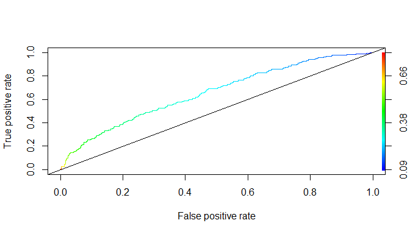
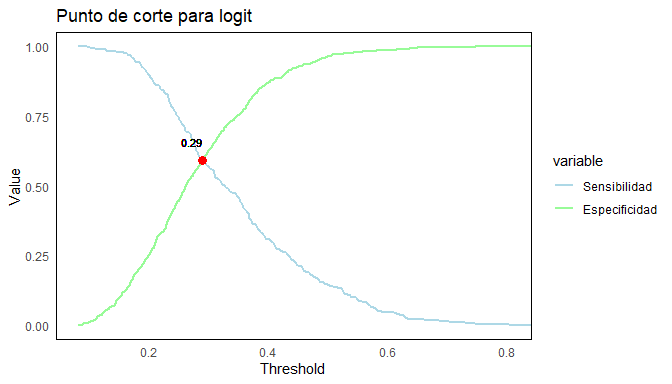

Proyecto de fin de módulo 4
================
Héctor Villegas
2024-05-27

*Librerías*

``` r
library(openxlsx)
library(gmodels)
library(ResourceSelection)
library(ROCR)
library(memisc)
library(QuantPsyc)
library(ggplot2)
library(knitr)
library(dplyr)
library(reshape2)
```

### 1- Base de datos

``` r
data_gc <- read.csv("D:\\Programa ECD\\M4\\proyecto\\db\\germancredit.csv")

data_gc %>% 
  head() %>% 
  kable()
```

| Default | checkingstatus1 | duration | history | purpose | amount | savings | employ | installment | status | others | residence | property | age | otherplans | housing | cards | job  | liable | tele | foreign |
|--------:|:----------------|---------:|:--------|:--------|-------:|:--------|:-------|------------:|:-------|:-------|----------:|:---------|----:|:-----------|:--------|------:|:-----|-------:|:-----|:--------|
|       0 | A11             |        6 | A34     | A43     |   1169 | A65     | A75    |           4 | A93    | A101   |         4 | A121     |  67 | A143       | A152    |     2 | A173 |      1 | A192 | A201    |
|       1 | A12             |       48 | A32     | A43     |   5951 | A61     | A73    |           2 | A92    | A101   |         2 | A121     |  22 | A143       | A152    |     1 | A173 |      1 | A191 | A201    |
|       0 | A14             |       12 | A34     | A46     |   2096 | A61     | A74    |           2 | A93    | A101   |         3 | A121     |  49 | A143       | A152    |     1 | A172 |      2 | A191 | A201    |
|       0 | A11             |       42 | A32     | A42     |   7882 | A61     | A74    |           2 | A93    | A103   |         4 | A122     |  45 | A143       | A153    |     1 | A173 |      2 | A191 | A201    |
|       1 | A11             |       24 | A33     | A40     |   4870 | A61     | A73    |           3 | A93    | A101   |         4 | A124     |  53 | A143       | A153    |     2 | A173 |      2 | A191 | A201    |
|       0 | A14             |       36 | A32     | A46     |   9055 | A65     | A73    |           2 | A93    | A101   |         4 | A124     |  35 | A143       | A153    |     1 | A172 |      2 | A192 | A201    |

### 2- Modelos de probabilidad

*Descripción de las variables seleccionadas:*

- Default: 1=mal pagador
- duration: plazo de la operación
- amount: monto de la operación
- installment: cuotas pagadas
- age: edad
- cards: número de tarjetas de crédito

Se define una nueva variable ageq que almacenará la edad al cuadrado.

``` r
db_gc <- data_gc %>%
  dplyr::select(Default, duration, amount, installment, age, cards) %>% 
  mutate(ageq=(age)^2)

attach(db_gc)

db_gc %>% 
  head() %>% 
  kable()
```

| Default | duration | amount | installment | age | cards | ageq |
|--------:|---------:|-------:|------------:|----:|------:|-----:|
|       0 |        6 |   1169 |           4 |  67 |     2 | 4489 |
|       1 |       48 |   5951 |           2 |  22 |     1 |  484 |
|       0 |       12 |   2096 |           2 |  49 |     1 | 2401 |
|       0 |       42 |   7882 |           2 |  45 |     1 | 2025 |
|       1 |       24 |   4870 |           3 |  53 |     2 | 2809 |
|       0 |       36 |   9055 |           2 |  35 |     1 | 1225 |

*Modelo Logit*

``` r
logit=glm(Default~., family = binomial(link="logit"),
          data=db_gc)
```

*Modelo Probit*

``` r
probit=glm(Default~., family = binomial(link="probit"),
          data=db_gc)
```

*Resultados*

``` r
mtable(logit,probit,digits = 6,sdigits = 3)
```

    ## 
    ## Calls:
    ## logit: glm(formula = Default ~ ., family = binomial(link = "logit"), 
    ##     data = db_gc)
    ## probit: glm(formula = Default ~ ., family = binomial(link = "probit"), 
    ##     data = db_gc)
    ## 
    ## ==================================================
    ##                       logit           probit      
    ## --------------------------------------------------
    ##   (Intercept)        0.379896        0.194212     
    ##                     (0.740033)      (0.444455)    
    ##   duration           0.026954***     0.016563***  
    ##                     (0.007714)      (0.004688)    
    ##   amount             0.000073*       0.000044*    
    ##                     (0.000034)      (0.000021)    
    ##   installment        0.216509**      0.127097**   
    ##                     (0.072900)      (0.043100)    
    ##   age               -0.120182**     -0.070784**   
    ##                     (0.037749)      (0.022523)    
    ##   cards             -0.122818       -0.073331     
    ##                     (0.130105)      (0.076735)    
    ##   ageq               0.001227**      0.000720**   
    ##                     (0.000450)      (0.000268)    
    ## --------------------------------------------------
    ##   Log-likelihood  -576.067        -575.947        
    ##   N               1000            1000            
    ## ==================================================
    ##   Significance: *** = p < 0.001; ** = p < 0.01;   
    ##                 * = p < 0.05

Se observa que en el modelo Probit la variable que más influye en la
probabilidad de ser un mal pagador es installment (cuotas pagadas).  

Para analizar el modelo Logit se procede con el cálculo de los odds
ratios:

``` r
exp(coef(logit))
```

    ## (Intercept)    duration      amount installment         age       cards 
    ##   1.4621324   1.0273206   1.0000735   1.2417341   0.8867594   0.8844245 
    ##        ageq 
    ##   1.0012276

A medida que installment crece es 1.24 veces más probable que un cliente
sea un mal pagador.

### 3- Evaluación de modelos

#### Contraste HL

H0: La bondad de ajuste es buena  
H1: La bondad de ajuste no es buena

*Logit*

``` r
hoslem.test(db_gc$Default, 
                   fitted(logit), g=10)
```

    ## 
    ##  Hosmer and Lemeshow goodness of fit (GOF) test
    ## 
    ## data:  db_gc$Default, fitted(logit)
    ## X-squared = 7.6569, df = 8, p-value = 0.4677

*Probit*

``` r
hoslem.test(db_gc$Default, 
                   fitted(probit), g=10)
```

    ## 
    ##  Hosmer and Lemeshow goodness of fit (GOF) test
    ## 
    ## data:  db_gc$Default, fitted(probit)
    ## X-squared = 8.0644, df = 8, p-value = 0.4272

De acuerdo con el contraste Hosmer and Lemeshow ejecutado sobre ambos
modelos, el valor p es mayor a 0.05 por lo que no se puede rechazar la
hipótesis nula y se concluye que la bondad de ajuste es buena tanto para
Logit y Probit.

#### Matriz de confusión

Para construir la matriz de confusión se establece como umbral el
promedio de los valores ajustados:

*Logit*

``` r
umbral_lo <- mean(fitted(logit))
umbral_lo
```

    ## [1] 0.3

``` r
ClassLog(logit,db_gc$Default, cut = umbral_lo)
```

    ## $rawtab
    ##        resp
    ##           0   1
    ##   FALSE 444 132
    ##   TRUE  256 168
    ## 
    ## $classtab
    ##        resp
    ##                 0         1
    ##   FALSE 0.6342857 0.4400000
    ##   TRUE  0.3657143 0.5600000
    ## 
    ## $overall
    ## [1] 0.612
    ## 
    ## $mcFadden
    ## [1] 0.05696396

*Probit*

``` r
umbral_po <- mean(fitted(probit))
umbral_po
```

    ## [1] 0.2998774

``` r
ClassLog(probit,db_gc$Default, cut = umbral_po)
```

    ## $rawtab
    ##        resp
    ##           0   1
    ##   FALSE 439 130
    ##   TRUE  261 170
    ## 
    ## $classtab
    ##        resp
    ##                 0         1
    ##   FALSE 0.6271429 0.4333333
    ##   TRUE  0.3728571 0.5666667
    ## 
    ## $overall
    ## [1] 0.609
    ## 
    ## $mcFadden
    ## [1] 0.05716079

#### Curva ROC

*Logit*

``` r
pred_lo <- prediction(logit$fitted.values, db_gc$Default)
```

``` r
perf_lo <- performance(pred_lo, 
                    measure = "tpr", 
                    x.measure = "fpr") 
plot(perf_lo, colorize=T,lty=3)
abline(0,1,col="black")
```



Área bajo la curva:

``` r
aucl <- performance(pred_lo, measure = "auc")

aucl@y.values[[1]]
```

    ## [1] 0.6558952

Analizando el gráfico se observa que la curva ROC está cercana a la
recta identidad que representa al clasificador aleatorio, lo cual indica
que el modelo Logit no tiene una precisión muy alta. Esto se ve
reflejado en el valor del AUC que es de 0.66.

*Probit*

``` r
pred_pr <- prediction(probit$fitted.values, db_gc$Default)
```

``` r
perf_pr <- performance(pred_pr, 
                    measure = "tpr", 
                    x.measure = "fpr")

plot(perf_pr, colorize=T,lty=3)
abline(0,1,col="black")
```


Área bajo la curva:

``` r
aucp <- performance(pred_pr, measure = "auc")

aucp@y.values[[1]]
```

    ## [1] 0.6557667

La curva ROC del modelo Probit tiene un comportamiento parecido a la del
Logit, está muy cerca de la recta identidad y el valor del AUC es de
0.66.

#### Punto de corte óptimo

El punto de corte óptimo es aquel donde la sensibilidad y la especifidad
se cortan. Para encontrarlo y graficarlo se define la siguiente función:

``` r
plot_cutoff <- function(prediction.obj, title) {
  
  # Obtener los valores de sensibilidad y especificidad
  perf <- performance(prediction.obj, "sens", "spec")
  sen <- slot(perf, "y.values")[[1]]
  esp <- slot(perf, "x.values")[[1]]
  alf <- slot(perf, "alpha.values")[[1]]
  
  # Obtener el punto de intersección
  diff <- abs(sen - esp)
  index <- which.min(diff)
  intersec_alf <- alf[index]
  intersec_value <- sen[index]
  
  # Crear el dataframe
  mat <- data.frame(alf, sen, esp)
  mat <- melt(mat, id.vars = "alf")
  
  # Crear el gráfico
  ggplot(mat) +
    aes(x = alf, y = value, group = variable, colour = variable) +
    geom_line(linewidth = 0.8) +
    geom_point(aes(x = intersec_alf, y = intersec_value), color = "red", size = 3) +
    geom_text(aes(x = intersec_alf, y = intersec_value, label = round(intersec_alf, 2)),
              vjust = -1.5, hjust = 1, color = "black", size = 3) +
    labs(
      title = title,
      x = 'Threshold',
      y = 'Value'
    ) +
    scale_color_manual(values = c("#ADD8E6", "#98FB98"),
                       labels = c('Sensibilidad', 'Especificidad')) +
    theme_minimal() +
    theme(
      panel.border = element_rect(color = "black", fill = NA, linewidth = 0.5),
      panel.grid.major = element_blank(),  # Eliminar la cuadrícula mayor
      panel.grid.minor = element_blank()   # Eliminar la cuadrícula menor
    )
}
```

*Logit*

``` r
plot_cutoff(pred_lo, "Punto de corte para logit")
```


*Probit*

``` r
plot_cutoff(pred_pr, "Punto de corte para logit")
```



Los umbrales óptimos son iguales a los que se habían definido mediante
el promedio de los valores ajustados, por lo que no habrá diferencia en
la reclasificación.

### 4- Reclasificación

*Logit*

``` r
ClassLog(logit,db_gc$Default, cut = 0.29)
```

    ## $rawtab
    ##        resp
    ##           0   1
    ##   FALSE 420 124
    ##   TRUE  280 176
    ## 
    ## $classtab
    ##        resp
    ##                 0         1
    ##   FALSE 0.6000000 0.4133333
    ##   TRUE  0.4000000 0.5866667
    ## 
    ## $overall
    ## [1] 0.596
    ## 
    ## $mcFadden
    ## [1] 0.05696396

Sensibilidad: tp/(tp+fn)

``` r
176/(176 + 124)
```

    ## [1] 0.5866667

Especifidad: tn/(tn+fp)

``` r
420/(420 + 280)
```

    ## [1] 0.6

*Probit*

``` r
ClassLog(probit,db_gc$Default, cut = 0.29)
```

    ## $rawtab
    ##        resp
    ##           0   1
    ##   FALSE 418 124
    ##   TRUE  282 176
    ## 
    ## $classtab
    ##        resp
    ##                 0         1
    ##   FALSE 0.5971429 0.4133333
    ##   TRUE  0.4028571 0.5866667
    ## 
    ## $overall
    ## [1] 0.594
    ## 
    ## $mcFadden
    ## [1] 0.05716079

Sensibilidad: tp/(tp+fn)

``` r
176/(176 + 124)
```

    ## [1] 0.5866667

Especifidad: tn/(tn+fp)

``` r
418/(418 + 282)
```

    ## [1] 0.5971429

### 5- Proyección

*Datos*

``` r
newdata <- data.frame(duration=7,
                      amount=1600,
                      installment=8,
                      age=32,
                      ageq=1024,
                      cards=2)
```

*Logit*

``` r
predict(logit,newdata,type = "response")
```

    ##         1 
    ## 0.3972496

*Probit*

``` r
predict(probit,newdata,type = "response")
```

    ##         1 
    ## 0.3907596

La probabilidad de que el cliente sea un mal pagador es del 40% con
ambos modelos. Dado que el umbral es de 0.29 se concluye que esta
persona no pagará el crédito.

### 6- Análisis

Tras evaluar ambos modelos, logit y probit, a través de varias métricas
de rendimiento, se puede concluir lo siguiente:

1.  **Significancia**: Ambos modelos tienen parámetros significativos.

2.  **Especificidad y Sensibilidad**: Las métricas de especificidad y
    sensibilidad son similares entre ambos modelos.

3.  **Área Bajo la Curva (AUC)**: El AUC tanto del modelo Logit como del
    modelo Probit es de 0.65. Ambos modelos presentan un rendimiento
    similar en términos de discriminación entre las clases.

Dado que ambos modelos presentan un rendimiento similar, y considerando
la mayor familiaridad y uso extendido del modelo logit en la industria,
me inclinaría por este último. Sin embargo, debido a que el AUC no es
muy alto, no recomendaría su uso en un escenario real.
